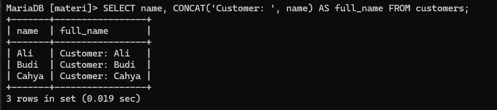
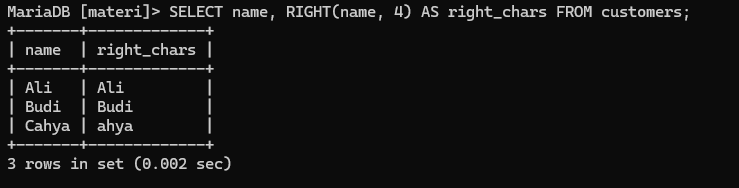

# Modul Fungsi String dalam SQL

## Definisi
Fungsi String dalam `SQL` digunakan untuk memanipulasi data berbasis teks dalam database. Fungsi ini berguna untuk mengubah format teks, mengganti karakter, menggabungkan `string`, dan operasi lainnya yang melibatkan tipe data teks `(VARCHAR, TEXT, CHAR, dll.)`.

---
## Fungsi/Luaran
Fungsi String digunakan untuk berbagai keperluan, seperti:
- Menghitung panjang string
- Mengubah huruf menjadi huruf besar atau kecil
- Mengganti sebagian teks dalam string
- Menggabungkan beberapa string menjadi satu
- Mengambil karakter dari kiri atau kanan string.
- Menambahkan karakter di depan atau belakang string dengan panjang tertentu.

---
## Contoh Query Beserta Hasil dan Penjelasan
### Tabel Utama: `customers`


---
### Menghitung Panjang String
#### Penjelasan
Query ini menghitung jumlah karakter dalam kolom `name` untuk setiap pelanggan dan menampilkannya dalam kolom baru `name_length`.
#### Format
```mysql
SELECT kolom_string, LENGTH(kolom_string) AS alias_nama FROM nama_tabel;
```
#### Contoh Query
```mysql
SELECT name, LENGTH(name) AS name_length FROM customers;
```
#### Analisis
- `SELECT` → Memilih kolom yang ingin ditampilkan.
- `nama` → Menampilkan nilai asli dari kolom `nama`.
- `LENGTH(nama)` → Menghitung panjang karakter dari nilai dalam kolom `nama`.
- `AS panjang_nama` → Memberikan alias untuk hasil panjang string sebagai `panjang_nama`.
- `FROM pelanggan` → Data diambil dari tabel `pelanggan`.
#### Hasil


---
### Mengubah String ke Huruf Besar
#### Penjelasan 
Query ini mengubah semua huruf dalam kolom `name` menjadi huruf besar dan menampilkannya sebagai `uppercase_name`.
#### Format
```mysql
SELECT kolom_string, UPPER(kolom_string) AS alias_nama FROM nama_tabel;
```
#### Contoh Query
```sql
SELECT name, UPPER(name) AS uppercase_name FROM customers;
```
#### Analisis
- `SELECT` → Memilih kolom yang ingin ditampilkan.
- `nama` → Menampilkan nilai asli dari kolom `nama`.
- `UPPER(nama)` → Mengubah semua huruf dalam kolom `nama` menjadi huruf besar.
- `AS nama_besar` → Memberikan alias untuk hasil sebagai `nama_besar`.
- `FROM pelanggan` → Data diambil dari tabel `pelanggan`.
#### Hasil


---
### Mengubah String ke Huruf Kecil
#### Penjelasan
Query ini mengubah semua huruf dalam kolom `name` menjadi huruf kecil dan menampilkannya sebagai `lowercase_name`.
#### Format
```mysql
SELECT kolom_string, LOWER(kolom_string) AS alias_nama FROM nama_tabel;
```
#### Contoh Query
```sql
SELECT name, LOWER(name) AS lowercase_name FROM customers;
```
#### Analisis
- `SELECT` → Memilih kolom yang ingin ditampilkan.
- `nama` → Menampilkan nilai asli dari kolom `nama`.
- `LOWER(nama)` → Mengubah semua huruf dalam kolom `nama` menjadi huruf kecil.
- `AS nama_kecil` → Memberikan alias untuk hasil sebagai `nama_kecil`.
- `FROM pelanggan` → Data diambil dari tabel `pelanggan`.
#### Hasil


---
### Mengganti Bagian dari String
#### Penjelasan 
Query ini mengganti kata "example" dalam kolom `email` dengan "test" untuk setiap pelanggan dan menampilkan hasilnya dalam kolom `new_email`.
#### Format
```mysql
SELECT kolom_string, REPLACE(kolom_string, 'string_lama', 'string_baru') AS alias_nama FROM nama_tabel;
```
#### Contoh Query
```sql
SELECT name, REPLACE(email, 'example', 'test') AS new_email FROM customers;
```
#### Analisis
- `SELECT` → Memilih kolom yang ingin ditampilkan.
- `nama` → Menampilkan nilai asli dari kolom `nama`.
- `REPLACE(email, 'contoh', 'ujicoba')` → Mengganti kata `'contoh'` dalam kolom `email` menjadi `'ujicoba'`.
- `AS email_baru` → Memberikan alias untuk hasil penggantian sebagai `email_baru`.
- `FROM pelanggan` → Data diambil dari tabel `pelanggan`.
#### Hasil


---
### Menggabungkan String
#### Penjelasan
Query ini menggabungkan string "Customer: " dengan nama pelanggan dalam kolom `name`, lalu menampilkannya sebagai `full_name`.
#### Format
```mysql
SELECT kolom_string, CONCAT(string1, string2, ...) AS alias_nama FROM nama_tabel;
```
#### Contoh Query
```sql
SELECT name, CONCAT('Customer: ', name) AS full_name FROM customers;
```
#### Analisis
- `SELECT` → Memilih kolom yang ingin ditampilkan.
- `nama` → Menampilkan nilai asli dari kolom `nama`.
- `CONCAT('Pelanggan: ', nama)` → Menggabungkan string `'Pelanggan: '` dengan nilai kolom `nama`.
- `AS nama_lengkap` → Memberikan alias untuk hasil penggabungan sebagai `nama_lengkap`.
- `FROM pelanggan` → Data diambil dari tabel `pelanggan`.
#### Hasil


----
### Mengambil Karakter dari Kiri String
#### Penjelasan
Query ini mengambil 4 karakter pertama dari kolom `name`.
#### Format
```mysql
SELECT kolom_string, LEFT(kolom_string, panjang) AS alias_nama FROM nama_tabel;
```
#### Contoh Query
```mysql
SELECT name, LEFT(name, 4) AS left_chars FROM customers;
```
#### Analisis
- `SELECT` → Memilih kolom yang ingin ditampilkan.
- `nama` → Menampilkan nilai asli dari kolom `nama`.
- `LEFT(nama, 4)` → Mengambil 4 karakter pertama dari nilai kolom `nama`.
- `AS karakter_kiri` → Memberikan alias untuk hasil pengambilan karakter pertama sebagai `karakter_kiri`.
- `FROM pelanggan` → Data diambil dari tabel `pelanggan`.
#### Hasil


----
### Mengambil Karakter dari Kanan String
#### Penjelasan
Query ini mengambil  karakter terakhir dari kolom `name`.
#### Format
```mysql
SELECT kolom_string, RIGHT(kolom_string, panjang) AS alias_nama FROM nama_tabel;
```
#### Contoh Query
```mysql
SELECT name, RIGHT(name, 4) AS right_chars FROM customers;
```
#### Analisis
- `SELECT` → Memilih kolom yang ingin ditampilkan.
- `nama` → Menampilkan nilai asli dari kolom `nama`.
- `RIGHT(nama, 4)` → Mengambil 4 karakter terakhir dari nilai kolom `nama`.
- `AS karakter_kanan` → Memberikan alias untuk hasil pengambilan karakter terakhir sebagai `karakter_kanan`.
- `FROM pelanggan` → Data diambil dari tabel `pelanggan`.
#### Hasil


---
### Menambahkan Karakter di Depan String
#### Penjelasan
Query ini menambahkan karakter `*` di depan string `name` hingga panjang totalnya menjadi 10 karakter.
#### Format
```mysql
SELECT kolom_string, LPAD(kolom_string, panjang_total, karakter_penyusun) AS alias_nama FROM nama_tabel;
```
#### Contoh Query
```mysql
SELECT name, LPAD(name, 10, '*') AS padded_name FROM customers;
```
#### Analisis
- `SELECT` → Memilih kolom yang ingin ditampilkan.
- `nama` → Menampilkan nilai asli dari kolom `nama`.
- `LPAD(nama, 10, '*')` → Menambahkan karakter `*` di depan nilai kolom `nama` hingga panjang totalnya menjadi 10 karakter.
- `AS nama_dengan_padded` → Memberikan alias untuk hasil padding sebagai `nama_dengan_padded`.
- `FROM pelanggan` → Data diambil dari tabel `pelanggan`.
#### Hasil


---
### Menambahkan Karakter di Belakang String
#### Penjelasan
Query ini menambahkan karakter `#` di belakang string `name` hingga panjang totalnya menjadi 10 karakter.
#### Format
```mysql
SELECT kolom_string, RPAD(kolom_string, panjang_total, karakter_penyusun) AS alias_nama FROM nama_tabel;
```
#### Contoh Query
```mysql
SELECT name, RPAD(name, 10, '#') AS padded_name FROM customers;
```
#### Analisis
- `SELECT` → Memilih kolom yang ingin ditampilkan.
- `nama` → Menampilkan nilai asli dari kolom `nama`.
- `RPAD(nama, 10, '#')` → Menambahkan karakter `#` di belakang nilai kolom `nama` hingga panjang totalnya menjadi 10 karakter.
- `AS nama_dengan_padded` → Memberikan alias untuk hasil padding sebagai `nama_dengan_padded`.
- `FROM pelanggan` → Data diambil dari tabel `pelanggan`.
#### Hasil


----

## Studi Kasus Lengkap : Migrasi Data Pelanggan dan Validasi Email

### Latar Belakang

Perusahaan e-commerce `TokoOnlineX` sedang melakukan migrasi sistem ke platform baru. Dalam proses ini, ditemukan bahwa banyak data pelanggan yang tidak seragam, terutama dalam format email. Beberapa masalah yang muncul:

1. Email masih menggunakan domain lama `example.com`.
2. Beberapa email tidak menggunakan huruf kecil (case sensitive).
3. Ada pelanggan yang memiliki data duplikat karena perbedaan format email (contoh: `John.Doe@example.com` vs `john.doe@company.com`).
4. Sistem baru mewajibkan semua email diawali dengan huruf kecil dan domain `company.com`.

---
### Tujuan

Melakukan pembersihan dan standarisasi email pelanggan untuk:
- Mengganti domain lama ke `company.com`.
- Mengubah semua karakter email menjadi huruf kecil.
- Menghapus data pelanggan yang duplikat berdasarkan email yang sudah distandarkan.
---
### Tabel Utama (Before)


---
### Langkah-langkah Solusi dengan SQL

#### 1. Ubah semua email menjadi huruf kecil dan ganti domain

```sql
UPDATE customers
SET email = REPLACE(LOWER(email), 'example.com', 'company.com');
```
##### Penjelasan
- `LOWER(email)` → Mengubah semua huruf pada email menjadi huruf kecil.
- `REPLACE(..., 'example.com', 'company.com')` → Mengganti domain lama menjadi yang baru.
##### Hasil


---
#### 2. Hapus data pelanggan yang duplikat berdasarkan email (setelah distandarisasi)

Misalnya kita hanya ingin menyimpan satu data saja untuk setiap email yang sama.

```sql
DELETE c1 FROM customers c1 JOIN customers c2 ON c1.email = c2.email WHERE c1.id > c2.id;
```
##### Penjelasan
- `DELETE c1` → Menghapus data dari alias `c1`, yaitu baris dari tabel `customers` yang memenuhi kondisi tertentu.
- `FROM customers c1` → Menentukan bahwa data yang akan dihapus berasal dari tabel `customers`, dengan alias `c1`.
- `JOIN customers c2` → Melakukan penggabungan (join) antara tabel `customers` dengan dirinya sendiri menggunakan alias `c2`.
- `ON c1.email = c2.email` → Syarat join: memilih baris-baris yang memiliki nilai `email` yang sama pada alias `c1` dan `c2`, menandakan data duplikat.
- `WHERE c1.id > c2.id` → Hanya baris dengan `id` yang lebih besar dari pasangannya (duplikat) yang akan dihapus, sehingga baris pertama (id terkecil) tetap dipertahankan.

##### Hasil


---
