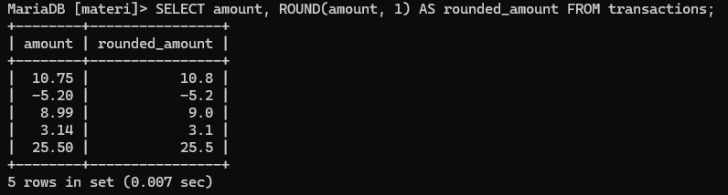

# Modul Fungsi Math dalam SQL

## Definisi
Fungsi Math dalam `SQL` digunakan untuk melakukan operasi matematika pada data numerik dalam database. Fungsi ini berguna untuk perhitungan angka, pembulatan, penarikan akar kuadrat, dan berbagai operasi numerik lainnya.

---
## Fungsi/Luaran
Fungsi Math digunakan untuk berbagai keperluan, seperti:
- Menghitung nilai absolut untuk mengetahui seberapa besar angka tanpa memperhatikan tanda positif atau negatif.
- Membulatkan angka ke atas atau ke bawah untuk menyesuaikan nilai ke bilangan bulat yang lebih besar atau lebih kecil.
- Menentukan akar kuadrat dari suatu angka untuk keperluan analisis data.
- Melakukan operasi dasar seperti penjumlahan, pengurangan, perkalian, dan pembagian untuk manipulasi data numerik.

---
## Contoh Query Beserta Hasil dan Penjelasan
### Tabel Utama: `transactions`


Tabel `transactions` digunakan untuk menyimpan data transaksi keuangan dengan kolom `amount` yang menyimpan nilai dalam format desimal.

---
### Menghitung Nilai Absolut
#### Penjelasan
Fungsi `ABS()` mengubah angka negatif menjadi positif tanpa mengubah angka positif. Ini berguna dalam laporan keuangan untuk melihat total transaksi tanpa memperhatikan arah transaksi.
#### Format Query
```sql
SELECT kolom, ABS(kolom) AS alias FROM nama_tabel;
```
#### Contoh Query
```sql
SELECT amount, ABS(amount) AS absolute_value FROM transactions;
```
#### Analisis
- `SELECT`  Memilih kolom yang ingin ditampilkan.
- `amount`  Menampilkan nilai asli transaksi.
- `ABS(amount)`  Mengubah nilai negatif menjadi positif.
- `AS absolute_value`  Memberikan alias untuk hasil sebagai `absolute_value`.
- `FROM transactions` data diambil dari tabel Transaksi
#### Hasil


---
### Membulatkan Angka
#### Penjelasan
Fungsi `ROUND()` digunakan untuk membulatkan angka hingga jumlah desimal tertentu, dalam hal ini satu desimal.
#### Format Query
```mysql
SELECT kolom, ROUND(kolom, jumlah_desimal) AS alias FROM nama_tabel;
```
#### Contoh Query
```sql
SELECT amount, ROUND(amount, 1) AS rounded_amount FROM transactions;
```
#### Analisis
- `SELECT`  Memilih kolom yang ingin ditampilkan.
- `amount`  Menampilkan nilai asli transaksi.
- `ROUND(amount, 1)`  Membulatkan `amount` menjadi **1 desimal**.
- `AS rounded_amount`  Memberi alias hasil pembulatan.
- `FROM transactions` data diambil dari tabel Transaksi
#### Hasil


---
### Membulatkan ke Atas
#### Penjelasan
Fungsi `CEIL()` selalu membulatkan angka ke atas ke bilangan bulat terdekat.
#### Format Query
```mysql
SELECT kolom, CEIL(kolom) AS alias FROM nama_tabel;
```
#### Contoh Query
```sql
SELECT amount, CEIL(amount) AS ceiling_value FROM transactions;
```
#### Analisis
- `SELECT`  Memilih kolom yang ingin ditampilkan.
- `amount`  Menampilkan nilai asli transaksi.
- `CEIL(amount)`  Membulatkan angka **ke atas** ke bilangan bulat terdekat.
- `AS ceiling_value`  Memberi alias `ceiling_value`.
- `FROM transactions` data diambil dari tabel Transaksi
#### Hasil


---
### Membulatkan ke Bawah
#### Penjelasan
Fungsi `FLOOR()` membulatkan angka ke bawah ke bilangan bulat terdekat.
#### Format Query
```mysql
SELECT kolom, FLOOR(kolom) AS alias FROM nama_tabel;
```
#### Contoh Query
```sql
SELECT amount, FLOOR(amount) AS floor_value FROM transactions;
```
#### Analisis
- `SELECT`  Memilih kolom yang ingin ditampilkan.
- `amount`  Menampilkan nilai asli transaksi.
- `FLOOR(amount)` Membulatkan angka **ke bawah** ke bilangan bulat terdekat.
- `AS floor_value`  Memberi alias `floor_value`.
- `FROM transactions` data diambil dari tabel Transaksi
#### Hasil


---
### Menghitung Akar Kuadrat
#### Penjelasan
Fungsi `SQRT()` digunakan untuk mendapatkan akar kuadrat dari suatu angka. Perlu dicatat bahwa angka negatif akan menghasilkan error karena akar kuadrat dari bilangan negatif tidak terdefinisi dalam SQL standar.
#### Format Query
```mysql
SELECT kolom, SQRT(kolom) AS alias FROM nama_tabel;
```
#### Contoh Query
```sql
SELECT amount, SQRT(amount) AS sqrt_value FROM transactions;
```
#### Analisis
- `SELECT`  Memilih kolom yang ingin ditampilkan.
- `amount`  Menampilkan nilai asli transaksi.
- `SQRT(amount)`  Menghitung **akar kuadrat** dari `amount`.
- `AS sqrt_value`  Memberi alias `sqrt_value`.
- `FROM transactions` data diambil dari tabel Transaksi
#### Hasil 


---
### Menghitung Pangkat
#### Penjelasan
Fungsi `POWER()` digunakan untuk menghitung hasil pemangkatan suatu angka. Dalam contoh ini, angka dipangkatkan dengan dua.
#### Format Query
```mysql
SELECT kolom, POWER(kolom, pangkat) AS alias FROM nama_tabel;
```
#### Contoh Query
```mysql
SELECT amount, POWER(amount, 2) AS squared_value FROM transactions;
```
#### Analisis
- `SELECT`  Memilih kolom yang ingin ditampilkan.
- `amount`  Menampilkan nilai asli transaksi.
- `POWER(amount, 2)`  Menghitung **amount pangkat 2**.
- `AS squared_value`  Memberi alias `squared_value`.
- `FROM transactions` data diambil dari tabel Transaksi
#### Hasil


---
### Menghitung Sisa Pembagian
#### Penjelasan
Fungsi `MOD()` digunakan untuk mendapatkan sisa pembagian suatu angka terhadap bilangan lain.
#### Format Query
```mysql
SELECT kolom, MOD(kolom, pembagi) AS alias FROM nama_tabel;
```
#### Contoh Query
```mysql
SELECT amount, MOD(amount, 3) AS mod_value FROM transactions;
```
#### Analisis
- `SELECT`  Memilih kolom yang ingin ditampilkan.
- `amount`  Menampilkan nilai asli transaksi.
- `MOD(amount, 3)`  Mengambil sisa pembagian `amount` dengan 3.
- `AS mod_value`  Memberi alias `mod_value`.
- `FROM transactions` data diambil dari tabel Transaksi
#### Hasil


---
## Studi Kasus : Penghitungan Nilai Rata-rata & Status Kelulusan Siswa

### 1. Deskripsi Kasus

Dalam sistem penilaian akademik, seorang guru ingin melakukan evaluasi terhadap nilai akhir siswa berdasarkan dua komponen utama, yaitu nilai **UTS (Ujian Tengah Semester)** dan **UAS (Ujian Akhir Semester)**. Tujuannya adalah:
- Menghitung **rata-rata nilai akhir** setiap siswa.
- Membulatkan hasil nilai ke **bilangan bulat terdekat** untuk mempermudah penilaian,
- Menentukan **status kelulusan** berdasarkan nilai akhir:
    - **Lulus** jika nilai akhir ≥ 75
    - **Tidak Lulus** jika nilai akhir < 75

#### Tabel Utama


#### Query Penghitungan Nilai dan Status

```mysql
SELECT id_siswa, nama, ROUND((uts + uas) / 2, 0) AS nilai_akhir,
CASE WHEN ROUND((uts + uas) / 2, 0) >= 75 THEN 'Lulus' ELSE 'Tidak Lulus'  END AS status FROM nilai_siswa;
```
#### Analisis
- **`SELECT`** → Mengambil data dari tabel. Bagian ini akan menampilkan kolom-kolom yang kita butuhkan dalam hasil akhir.
- **`id_siswa`** → Kolom yang menampilkan ID siswa sebagai identifikasi unik.
- **`nama`** → Kolom yang menampilkan nama siswa.
- **`ROUND((uts + uas) / 2, 0)`** → Fungsi `ROUND` membulatkan rata-rata nilai UTS dan UAS ke bilangan bulat terdekat.
    - `(uts + uas) / 2` → Menghitung rata-rata dari nilai UTS dan UAS.
    - `ROUND(..., 0)` → Membulatkan hasil rata-rata ke 0 angka di belakang koma (bilangan bulat).
    - **`AS nilai_akhir`** → Alias, memberi nama kolom baru hasil perhitungan sebagai `nilai_akhir`.
- **`CASE ... END`** → Struktur logika kondisional untuk menentukan status kelulusan.
    - **`WHEN ROUND((uts + uas) / 2, 0) >= 75 THEN 'Lulus'`** → Jika nilai akhir ≥ 75, maka statusnya adalah `'Lulus'`.
    - **`ELSE 'Tidak Lulus'`** → Jika nilai akhir < 75, maka statusnya adalah `'Tidak Lulus'`.
- **`AS status`** → Alias, memberi nama kolom hasil logika CASE sebagai `status`.
- **`FROM nilai_siswa`** → Menentukan bahwa semua data diambil dari tabel `nilai_siswa`

#### Hasil


---
