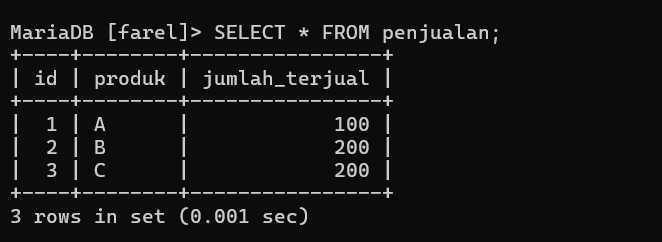
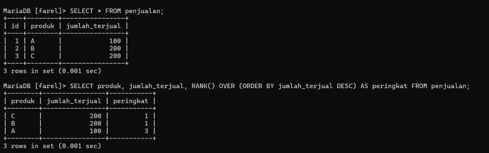
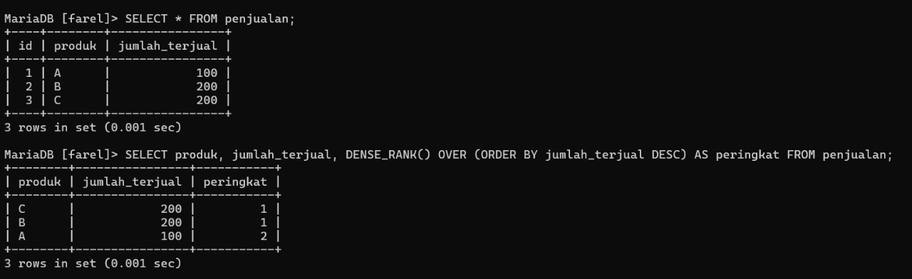
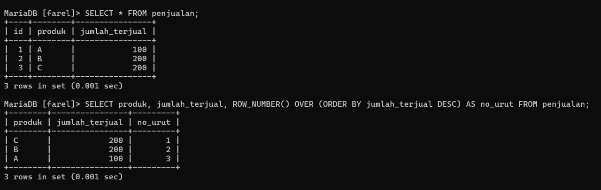
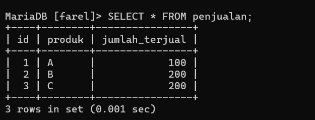
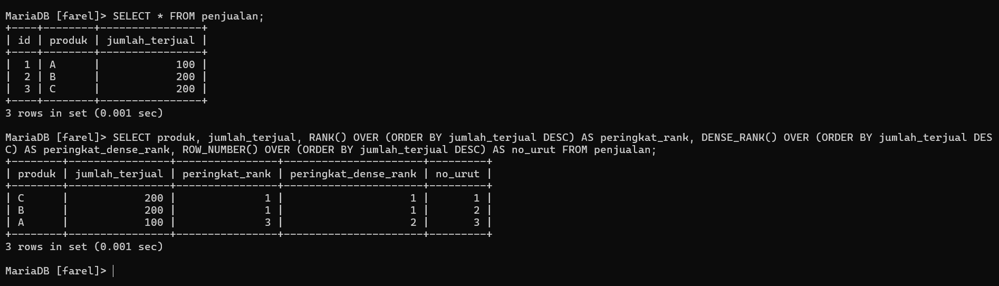

# Fungsi Ranking 

## Definisi
Fungsi Ranking dalam SQL digunakan untuk memberikan nomor urut atau peringkat pada data
dalam tabel berdasarkan suatu kriteria, seperti jumlah penjualan atau nilai ujian.

## Fungsi/Luaran
Fungsi Ranking digunakan untuk menentukan urutan atau peringkat data berdasarkan kriteria tertentu. Fungsi ini berguna dalam berbagai skenario, seperti:
- Menentukan peringkat penjualan berdasarkan jumlah transaksi.
- Memberikan nomor urut pada data tanpa menghilangkan duplikasi.
- Mengelompokkan data dengan tetap mempertahankan urutan aslinya.


---
## Tabel Utama: penjualan

>


---
### Menggunakan `RANK()`

#### PENJELASAN 
`RANK()` adalah **fungsi window** di SQL yang digunakan untuk memberikan **peringkat (ranking)** pada setiap baris data berdasarkan **urutan tertentu**. Peringkat diberikan **secara berurutan**, namun **jika ada nilai yang sama**, maka baris-baris tersebut akan **mendapatkan peringkat yang sama**, dan **peringkat selanjutnya akan dilompati**.
#### QUERY

```sql

SELECT produk, jumlah_terjual, RANK() OVER (ORDER BY jumlah_terjual DESC) AS peringkat FROM penjualan;

```

#### ANALISIS
- `SELECT` produk, jumlah_terjual  
    Ini akan memilih kolom produk dan jumlah_terjual dari tabel penjualan.
- `RANK() OVER` (`ORDER BY` jumlah_terjual `DESC`) `AS` peringkat 
    Fungsi `RANK()` adalah **fungsi window (window function)** yang digunakan untuk memberikan **peringkat** berdasarkan nilai tertentu.  
    Dalam hal ini, ranking diberikan berdasarkan kolom jumlah_terjual, diurutkan dari yang **terbanyak ke yang paling sedikit** (`DESC` = descending).
- `FROM` penjualan  
    Data diambil dari tabel bernama penjualan.

#### HASIL

>


---

### Menggunakan `DENSE_RANK()`

#### PENJELASAN 
`DENSE_RANK()` adalah **fungsi window (jendela)** di SQL yang digunakan untuk memberikan **peringkat (ranking)** pada baris-baris hasil query, berdasarkan **urutan dari nilai tertentu**.

#### QUERY

```sql

SELECT produk, jumlah_terjual, DENSE_RANK() OVER (ORDER BY jumlah_terjual DESC) AS peringkat FROM penjualan;

```

#### ANALISIS
- `SELECT` produk, jumlah_terjual
    Menampilkan kolom `produk` dan `jumlah_terjual` dari tabel `penjualan`.
- `DENSE_RANK() OVER` (`ORDER BY` jumlah_terjual `DESC`) `AS` peringkat
    `DENSE_RANK()` adalah fungsi **window** yang memberikan peringkat untuk setiap baris berdasarkan urutan dari kolom jumlah_terjual.
- `ORDER BY` jumlah_terjual `DESC` 
    berarti pengurutan dilakukan dari jumlah terjual terbanyak ke yang paling sedikit.
- Fungsi ini akan memberikan **peringkat yang sama** pada baris dengan nilai jumlah_terjual yang sama, **namun tidak melewati nomor urut berikutnya**.

#### HASIL

>


---

### Menggunakan `ROW_NUMBER()`

#### PENJELASAN 
`ROW_NUMBER()` adalah fungsi window (window function) di SQL yang digunakan untuk memberikan nomor urut unik untuk setiap baris hasil query, berdasarkan urutan tertentu.

#### QUERY

```sql

SELECT produk, jumlah_terjual, ROW_NUMBER() OVER (ORDER BY jumlah_terjual DESC) AS no_urut FROM penjualan;

```

#### ANALISIS
- `SELECT` produk, jumlah_terjual  
    Ini akan memilih kolom `produk` dan `jumlah_terjual` dari tabel `penjualan`.
- `ROW_NUMBER() OVER (ORDER BY jumlah_terjual DESC) AS no_urut`  
    Fungsi `ROW_NUMBER()` adalah **fungsi window** yang digunakan untuk memberikan **nomor urut unik** pada setiap baris hasil query.  
    Dalam hal ini, nomor urut diberikan berdasarkan kolom `jumlah_terjual` yang diurutkan dari **nilai terbesar ke terkecil** (`DESC` = descending).  
    Tidak seperti `RANK()` atau `DENSE_RANK()`, fungsi ini **tidak akan memberikan nomor yang sama**, bahkan jika nilai `jumlah_terjual` sama.
- `FROM penjualan`  
    Data diambil dari tabel bernama `penjualan`.

#### HASIL

>


---

## STUDI KASUS
Menentukan Peringkat Penjualan Produk Menggunakan Fungsi Ranking SQL

### KASUS
Sebuah perusahaan ritel ingin mengetahui performa setiap produk berdasarkan jumlah penjualan. Mereka ingin:
- Mengetahui produk mana yang paling laris.
- Menentukan peringkat penjualan dengan beberapa metode:
    - Peringkat dengan kemungkinan nilai sama dan loncatan (RANK).
    - Peringkat tanpa loncatan meskipun ada nilai yang sama (DENSE_RANK).
    - Nomor urut unik untuk tiap baris data (ROW_NUMBER).

Data penjualan disimpan dalam tabel `penjualan` yang memiliki dua kolom utama: `produk` dan `jumlah_terjual`.
Manajemen akan menggunakan informasi ini untuk mengambil keputusan strategi promosi dan stok produk.

---

#### Tabel Utama: penjualan

>

##### QUERY

```SQL

SELECT produk, jumlah_terjual, RANK() OVER (ORDER BY jumlah_terjual DESC) AS peringkat_rank, DENSE_RANK() OVER (ORDER BY jumlah_terjual DESC) AS peringkat_dense_rank, ROW_NUMBER() OVER (ORDER BY jumlah_terjual DESC) AS no_urut FROM penjualan;

```

#### ANALISIS
- `SELECT` produk, jumlah_terjual 
    Ini akan menampilkan kolom produk dan jumlah_terjual dari tabel penjualan.
- `RANK() OVER` (`ORDER BY` jumlah_terjual `DESC`) AS` `peringkat_rank
    Fungsi `RANK()` adalah fungsi window yang memberikan peringkat berdasarkan urutan jumlah_terjual dari terbesar ke terkecil.  
    Jika ada dua produk dengan jumlah terjual yang sama, maka mereka akan mendapat peringkat yang sama, tetapi peringkat berikutnya akan dilompati.
- `DENSE_RANK() OVER` (`ORDER BY` jumlah_terjual `DESC`) `AS` peringkat_dense_rank
    Fungsi `DENSE_RANK()` juga memberikan peringkat, namun tanpa melompati angka peringkat berikutnya walaupun ada nilai yang sama.  
    Cocok digunakan jika ingin ranking yang rapat (padat).
- `ROW_NUMBER() OVER` (`ORDER BY` jumlah_terjual `DESC`) `AS` no_urut
    Fungsi `ROW_NUMBER()` memberikan nomor urut unik ke setiap baris, tanpa memperhatikan nilai yang sama.  
    Setiap baris pasti mendapat nomor yang berbeda meskipun jumlah_terjual sama.
- `FROM` penjualan
    Mengambil data dari tabel penjualan.

##### HASIL

>

