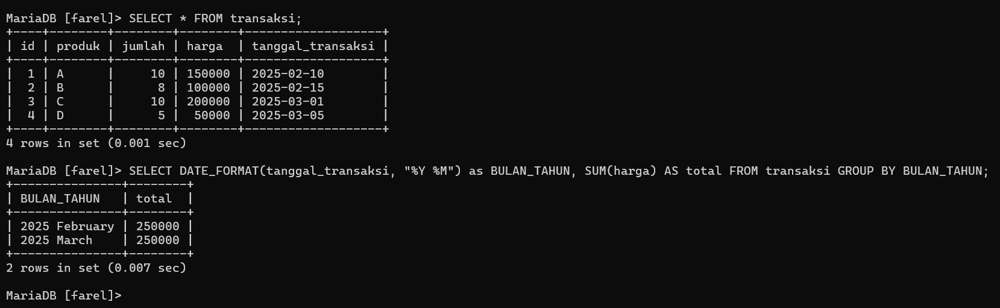

# FUNGSI TANGGAL dan WAKTU 

## Definisi
Fungsi tanggal dan waktu dalam SQL digunakan untuk mengolah data berbasis waktu, seperti
mencatat transaksi, menentukan tanggal jatuh tempo, atau menganalisis tren penjualan bulanan.
## Fungsi/Luaran
Fungsi tanggal dan waktu dalam SQL digunakan untuk mengolah data berbasis waktu. Beberapa kegunaannya antara lain:

- Menampilkan tanggal dan waktu saat ini untuk mencatat transaksi atau aktivitas sistem.
- Mengubah format tanggal sesuai kebutuhan laporan atau tampilan.
- Mengelompokkan data berdasarkan periode tertentu, seperti harian, bulanan, atau tahunan.
- Melakukan perhitungan selisih waktu, misalnya menentukan usia pelanggan atau lama transaksi berlangsung.

---

## Tabel Utama: transaksi

>

---

### Menggunakan `NOW()`

#### PENJELASAN 
`NOW()` adalah fungsi bawaan di SQL yang digunakan untuk mendapatkan waktu dan tanggal saat ini dari server basis data. Fungsi ini akan mengembalikan hasil berupa tanggal dan waktu lengkap dalam format `YYYY-MM-DD HH:MM:SS`.

#### QUERY

```sql

SELECT NOW() AS WAKTU_SEKARANG;

```

#### ANALISIS
- `SELECT NOW()`  
    Fungsi `NOW()` adalah fungsi bawaan di SQL yang digunakan untuk mendapatkan waktu dan tanggal saat ini sesuai dengan waktu server database.  
    Fungsi ini mengembalikan hasil berupa tanggal dan waktu lengkap dalam format `YYYY-MM-DD HH:MM:SS` (tergantung pada sistem basis data yang digunakan).
- `AS` WAKTU_SEKARANG  
    Kata kunci `AS` digunakan untuk memberikan alias atau nama baru pada kolom hasil query.  
    Dalam hal ini, hasil dari fungsi `NOW()` akan diberi nama alias WAKTU_SEKARANG.
- Tujuan dari query ini:  
    Query ini bertujuan untuk menampilkan waktu sekarang (waktu server) dalam format yang mudah dibaca, dengan nama kolom yang lebih deskriptif, yaitu WAKTU_SEKARANG.

#### HASIL

>

---

### Menggunakan `CURDATE()`

#### PENJELASAN 
`CURDATE()` adalah fungsi bawaan di SQL yang digunakan untuk mendapatkan tanggal hari ini dari server database, tanpa menyertakan waktu. Fungsi ini mengembalikan hasil dalam format `YYYY-MM-DD`.

#### QUERY

```sql

SELECT CURDATE() AS TANGGAL_HARI_INI;

```

#### ANALISIS
- `SELECT CURDATE()`  
    Fungsi `CURDATE()` adalah fungsi bawaan SQL yang digunakan untuk mengembalikan tanggal hari ini dari server database.  
    Fungsi ini hanya mengembalikan bagian tanggal tanpa menyertakan waktu, dalam format `YYYY-MM-DD`.
- `AS` TANGGAL_HARI_INI  
    Kata kunci `AS` digunakan untuk memberi alias atau nama kolom baru pada hasil query.  
    Dalam hal ini, hasil dari fungsi `CURDATE()` akan diberi alias `TANGGAL_HARI_INI`.
- Tujuan dari query ini:  
    Query ini bertujuan untuk menampilkan tanggal hari ini dengan nama kolom `TANGGAL_HARI_INI`.

#### HASIL

>

---

### Menggunakan `DATE_FORMAT()`

#### PENJELASAN 
`DATE_FORMAT()` adalah fungsi dalam SQL yang digunakan untuk memformat nilai tanggal atau waktu menjadi format yang diinginkan. Fungsi ini sangat berguna ketika kita perlu menampilkan tanggal dalam format yang lebih spesifik atau sesuai dengan kebutuhan tampilan.

#### QUERY

```sql

SELECT DATE_FORMAT(tanggal_transaksi, "%M %Y") AS BULAN_TAHUN FROM transaksi;

```

#### ANALISIS
- `SELECT DATE_FORMAT`(tanggal_transaksi, `"%M %Y"`)  
    Fungsi `DATE_FORMAT()` digunakan untuk memformat tanggal (tanggal_transaksi) sesuai dengan format yang diinginkan.  
    Di sini, format `"%M %Y"` digunakan, yang berarti:
    - `%M` → Menampilkan nama bulan dalam format teks lengkap (misalnya: "January", "February").
    - `%Y` → Menampilkan tahun dalam format 4 digit (misalnya: "2025").
- `AS` BULAN_TAHUN  
    Kata kunci `AS` digunakan untuk memberikan alias atau nama baru pada kolom hasil query.  
    Dalam hal ini, hasil dari fungsi `DATE_FORMAT()` diberi alias BULAN_TAHUN agar lebih deskriptif dan mudah dipahami.
- `FROM transaksi`  
    Data diambil dari tabel transaksi, yang memiliki kolom tanggal_transaksi.

#### HASIL

>

---

### Menggunakan `DATE_TRUNC()
`
#### **CATATAN:**
- `DATE_TRUNC` tersedia di PostgreSQL dan beberapa database lain seperti Snowflake dan BigQuery.
- MySQL **tidak** memiliki `DATE_TRUNC`, tetapi bisa menggunakan `DATE_FORMAT()`

#### CONTOH 1

##### PENJELASAN 
`DATE_TRUNC()` adalah fungsi dalam SQL yang digunakan untuk memotong (truncate) bagian-bagian tertentu dari nilai tanggal atau waktu, dan mengembalikan hasil dengan resolusi yang lebih rendah. Fungsi ini memungkinkan kita untuk menghapus bagian-bagian tertentu dari tanggal atau waktu, seperti hari, bulan, atau tahun, tergantung pada tingkat truncation yang diinginkan.

Fungsi ini terutama digunakan dalam sistem manajemen basis data yang mendukung **PostgreSQL**, karena tidak semua sistem SQL memiliki fungsi ini.

##### QUERY "Alternatif di MySQL (Simulasi `DATE_TRUNC`)"

```sql
SELECT DATE_FORMAT(tanggal_transaksi, "%M %Y 01") as BULAN_TAHUN, COUNT(*) AS jumlah_transaksi FROM transaksi GROUP BY DATE_FORMAT(tanggal_transaksi, "%M %Y 01");
```

##### ANALISIS
- `SELECT DATE_FORMAT`(tanggal_transaksi, `"%M %Y 01"`) `AS` BULAN_TAHUN  
    Fungsi `DATE_FORMAT()` digunakan untuk memformat kolom tanggal_transaksi.  
    Format `"%M %Y 01"` mengubah tanggal transaksi menjadi nama bulan lengkap dan tahun dalam format Bulan Tahun 01.  
    Misalnya, jika tanggal_transaksi adalah 2025-04-24, hasilnya adalah "April 2025 01". Alias BULAN_TAHUN memberikan nama pada kolom hasil format ini.
- `COUNT(*)` `AS` jumlah_transaksi 
    Fungsi agregat `COUNT(*)` digunakan untuk menghitung jumlah transaksi dalam grup yang telah ditentukan (berdasarkan bulan dan tahun).  
    Kolom hasil ini diberi alias jumlah_transaksi.
- `FROM` transaksi  
    Data diambil dari tabel transaksi, yang berisi informasi mengenai transaksi termasuk kolom tanggal_transaksi.
- `GROUP BY DATE_FORMAT`(tanggal_transaksi, `"%M %Y 01"`) 
    Klausa `GROUP BY` digunakan untuk mengelompokkan hasil berdasarkan bulan dan tahun yang sudah diformat.  
    Dalam hal ini, transaksi akan dikelompokkan berdasarkan bulan dan tahun, dengan tanggal ditetapkan ke 01 untuk setiap bulan.

##### HASIL

>

#### CONTOH 2

##### PENJELASAN 
`DATE_TRUNC()` adalah fungsi dalam SQL yang digunakan untuk memotong (truncate) bagian-bagian tertentu dari nilai tanggal atau waktu, dan mengembalikan hasil dengan resolusi yang lebih rendah. Fungsi ini memungkinkan kita untuk menghapus bagian-bagian tertentu dari tanggal atau waktu, seperti hari, bulan, atau tahun, tergantung pada tingkat truncation yang diinginkan.

Fungsi ini terutama digunakan dalam sistem manajemen basis data yang mendukung **PostgreSQL**, karena tidak semua sistem SQL memiliki fungsi ini.

##### QUERY "Alternatif di MySQL (Simulasi `DATE_TRUNC`)"

```sql
SELECT DATE_FORMAT(tanggal_transaksi, "%M %Y") as BULAN_TAHUN, COUNT(*) AS jumlah_transaksi FROM transaksi GROUP BY DATE_FORMAT(tanggal_transaksi, "%M %Y");
```

##### ANALISIS
- - `SELECT DATE_FORMAT`(tanggal_transaksi, `"%M %Y"`) `AS` BULAN_TAHUN`  
    Fungsi `DATE_FORMAT()` digunakan untuk memformat kolom tanggal_transaksi.  
    Format `"%M %Y"` mengubah tanggal transaksi menjadi nama bulan lengkap dan tahun dalam format Bulan Tahun (misalnya, "April 2025").  
    Alias BULAN_TAHUN memberikan nama pada kolom hasil format ini.
- `COUNT(*)` `AS` jumlah_transaksi 
    Fungsi agregat `COUNT(*)` digunakan untuk menghitung jumlah transaksi dalam grup yang telah ditentukan (berdasarkan bulan dan tahun).  
    Kolom hasil ini diberi alias jumlah_transaksi.
- `FROM` transaksi  
    Data diambil dari tabel transaksi, yang berisi informasi mengenai transaksi, termasuk kolom tanggal_transaksi.
    
- `GROUP BY DATE_FORMAT`(tanggal_transaksi, `"%M %Y"`)  
    Klausa `GROUP BY` digunakan untuk mengelompokkan hasil berdasarkan bulan dan tahun.  
    Dalam hal ini, transaksi akan dikelompokkan berdasarkan bulan dan tahun, tanpa memperhatikan hari atau waktu spesifik dari transaksi tersebut.

##### HASIL

>

#### CONTOH 3

##### PENJELASAN 
`DATE_TRUNC()` adalah fungsi dalam SQL yang digunakan untuk memotong (truncate) bagian-bagian tertentu dari nilai tanggal atau waktu, dan mengembalikan hasil dengan resolusi yang lebih rendah. Fungsi ini memungkinkan kita untuk menghapus bagian-bagian tertentu dari tanggal atau waktu, seperti hari, bulan, atau tahun, tergantung pada tingkat truncation yang diinginkan.

Fungsi ini terutama digunakan dalam sistem manajemen basis data yang mendukung **PostgreSQL**, karena tidak semua sistem SQL memiliki fungsi ini.

##### QUERY "Alternatif di MySQL (Simulasi `DATE_TRUNC`)"

```sql
SELECT DATE_FORMAT(tanggal_transaksi, "%Y %M") as BULAN_TAHUN, SUM(harga) AS total FROM transaksi GROUP BY BULAN_TAHUN;
```

##### ANALISIS
- - `SELECT DATE_FORMAT`(tanggal_transaksi, `"%Y %M"`) `AS` BULAN_TAHUN
    Fungsi `DATE_FORMAT()` digunakan untuk memformat kolom tanggal_transaksi menjadi format `"%Y %M"`, yaitu tahun (4 digit) diikuti oleh nama bulan lengkap.  
    Contohnya, jika tanggal_transaksi adalah `2025-04-24`, maka hasilnya akan menjadi "2025 April".  
    Hasil format ini diberi alias BULAN_TAHUN untuk digunakan sebagai nama kolom hasil.
- `SUM`(harga) `AS` total
    Fungsi agregat `SUM()` digunakan untuk menjumlahkan seluruh nilai dalam kolom harga pada setiap grup yang telah ditentukan.  
    Hasil penjumlahan ini diberi alias total.
- `FROM` transaksi
    Data diambil dari tabel transaksi, yang berisi data tentang transaksi, termasuk tanggal_transaksi dan harga.
- `GROUP BY` BULAN_TAHUN
    Klausa `GROUP BY` digunakan untuk mengelompokkan data berdasarkan hasil format tanggal yang telah dinamai BULAN_TAHUN.  
    Artinya, semua transaksi dengan bulan dan tahun yang sama akan digabung ke dalam satu grup, dan nilai harga dalam grup tersebut akan dijumlahkan.

##### HASIL

>

#### CONTOH 4

##### PENJELASAN 
`DATE_TRUNC()` adalah fungsi dalam SQL yang digunakan untuk memotong (truncate) bagian-bagian tertentu dari nilai tanggal atau waktu, dan mengembalikan hasil dengan resolusi yang lebih rendah. Fungsi ini memungkinkan kita untuk menghapus bagian-bagian tertentu dari tanggal atau waktu, seperti hari, bulan, atau tahun, tergantung pada tingkat truncation yang diinginkan.

Fungsi ini terutama digunakan dalam sistem manajemen basis data yang mendukung **PostgreSQL**, karena tidak semua sistem SQL memiliki fungsi ini.

##### QUERY "Alternatif di MySQL (Simulasi `DATE_TRUNC`)"

```sql
SELECT DATE_FORMAT(tanggal_transaksi, "%Y-%M") as BULAN_TAHUN, SUM(harga) AS total FROM transaksi GROUP BY BULAN_TAHUN;
```

##### ANALISIS
- `SELECT DATE_FORMAT`(tanggal_transaksi, `"%Y-%M"`) `AS` BULAN_TAHUN
    Fungsi `DATE_FORMAT()` digunakan untuk memformat kolom tanggal_transaksi menjadi format `"%Y-%M"`, yaitu tahun (4 digit) diikuti dengan tanda hubung (`-`) dan nama bulan lengkap.  
    Contohnya, jika tanggal_transaksi adalah "2025-04-24", maka hasilnya menjadi "2025-April".  
    Hasil format ini diberi alias BULAN_TAHUN.
- `SUM`(harga) `AS` total
    Fungsi agregat `SUM()` digunakan untuk menjumlahkan seluruh nilai dalam kolom harga untuk setiap grup.  
    Nilai hasil penjumlahan ini diberi alias total.
- `FROM` transaksi
    Data diambil dari tabel transaksi, yang berisi informasi termasuk kolom tanggal_transaksi dan harga.
- `GROUP BY` BULAN_TAHUN
    Klausa `GROUP BY` digunakan untuk mengelompokkan data berdasarkan nilai dari BULAN_TAHUN, yaitu hasil dari `DATE_FORMAT`.  
    Semua transaksi yang terjadi pada bulan dan tahun yang sama akan digabung dalam satu grup, dan nilai harga dalam grup tersebut akan dijumlahkan.

##### HASIL

>

#### CONTOH 5

##### PENJELASAN 
`DATE_TRUNC()` adalah fungsi dalam SQL yang digunakan untuk memotong (truncate) bagian-bagian tertentu dari nilai tanggal atau waktu, dan mengembalikan hasil dengan resolusi yang lebih rendah. Fungsi ini memungkinkan kita untuk menghapus bagian-bagian tertentu dari tanggal atau waktu, seperti hari, bulan, atau tahun, tergantung pada tingkat truncation yang diinginkan.

Fungsi ini terutama digunakan dalam sistem manajemen basis data yang mendukung **PostgreSQL**, karena tidak semua sistem SQL memiliki fungsi ini.

##### QUERY "Alternatif di MySQL (Simulasi `DATE_TRUNC`)"

```sql
SELECT DATE_FORMAT(tanggal_transaksi, "%Y-%m") as BULAN_TAHUN, SUM(harga) AS total FROM transaksi GROUP BY BULAN_TAHUN;
```

##### ANALISIS
- `SELECT DATE_FORMAT(tanggal_transaksi, "%Y-%m") AS BULAN_TAHUN`  
    Fungsi `DATE_FORMAT()` digunakan untuk memformat kolom `tanggal_transaksi` menjadi format `"%Y-%m"`, yaitu tahun (4 digit) diikuti dengan tanda hubung (`-`) dan bulan dalam angka dua digit.  
    Contohnya, jika tanggal_transaksi adalah "2025-04-24", maka hasilnya menjadi "2025-04"
    Hasil format ini diberi alias BULAN_TAHUN.    
- `SUM`(harga) `AS` total
    Fungsi agregat `SUM()` digunakan untuk menjumlahkan seluruh nilai dalam kolom harga untuk setiap grup.  
    Nilai hasil penjumlahan ini diberi alias total.   
- `FROM` transaksi 
    Data diambil dari tabel transaksi, yang berisi informasi mengenai tanggal transaksi dan harga. 
- `GROUP BY` BULAN_TAHUN
    Klausa `GROUP BY` digunakan untuk mengelompokkan data berdasarkan hasil format tanggal yang telah diberi alias BULAN_TAHUN.  
    Artinya, semua transaksi yang terjadi dalam bulan dan tahun yang sama akan dikelompokkan bersama, lalu nilai harga dalam setiap grup tersebut akan dijumlahkan.
##### HASIL

>


---

# cara membuat di phpmyadmin

 **Buka phpMyAdmin** dan pilih database yang digunakan.

>

Pilih tab **SQL** untuk menjalankan query.

>

**Buat tabel transaksi** dengan menjalankan query berikut:

QUERY:
```sql

CREATE TABLE transaksi (
    id INT AUTO_INCREMENT PRIMARY KEY,
    tanggal_transaksi DATETIME,
    jumlah DECIMAL(10,2)
);

```

>

**Masukkan data contoh** dengan query berikut:

QUERY:
```sql
INSERT INTO transaksi (tanggal_transaksi, jumlah) VALUES
('2025-03-01 10:15:00', 50000),
('2025-03-02 14:30:00', 75000),
('2025-03-03 09:45:00', 20000),
('2025-02-28 18:00:00', 100000);
```

>

---

**Jalankan query SQL** yang telah dijelaskan sebelumnya di tab SQL.

- Menggunakan `NOW()`

```sql
SELECT NOW() AS WAKTU_SEKARANG;
```

>

>

---

- Menggunakan `CURDATE()`

```sql
SELECT CURDATE() AS TANGGAL_HARI_INI;
```

>

>

---

- Menggunakan `DATE_FORMAT()`

```sql
SELECT DATE_FORMAT(tanggal_transaksi, "%M %Y") AS BULAN_TAHUN FROM transaksi;
```

>

>

---

- Menggunakan `DATE_TRUNC()`
  
Contoh 1

```sql
SELECT DATE_FORMAT(tanggal_transaksi, "%M %Y 01") as BULAN_TAHUN, COUNT(*) AS jumlah_transaksi FROM transaksi GROUP BY DATE_FORMAT(tanggal_transaksi, "%M %Y 01");
```

>

>

---

Contoh 2

```sql
SELECT DATE_FORMAT(tanggal_transaksi, "%M %Y") as BULAN_TAHUN, COUNT(*) AS jumlah_transaksi FROM transaksi GROUP BY DATE_FORMAT(tanggal_transaksi, "%M %Y");
```

>

>

---

Contoh 3

```sql
SELECT DATE_FORMAT(tanggal_transaksi, "%Y %M") as BULAN_TAHUN, SUM(harga) AS total FROM transaksi GROUP BY BULAN_TAHUN;
```

>

>

---

Contoh 4

```sql
SELECT DATE_FORMAT(tanggal_transaksi, "%Y-%M") as BULAN_TAHUN, SUM(harga) AS total FROM transaksi GROUP BY BULAN_TAHUN;
```

>

>

---

Contoh 5

```sql
SELECT DATE_FORMAT(tanggal_transaksi, "%Y-%m") as BULAN_TAHUN, SUM(harga) AS total FROM transaksi GROUP BY BULAN_TAHUN;
```

>

>

---

## STUDI KASUS
Laporan Penjualan Bulanan Berbasis Waktu Transaksi

### KASUS
Sebuah toko online menyimpan seluruh data transaksi di tabel `transaksi`. Manajemen ingin membuat laporan penjualan bulanan dengan informasi sebagai berikut:
- Tanggal dan waktu saat laporan diambil (real-time).
- Tanggal hari ini sebagai referensi data terbaru.
- Total transaksi yang terjadi dalam tiap bulan.
- Total pemasukan dari seluruh transaksi di bulan tersebut.

Laporan ini akan digunakan sebagai **dashboard bulanan** untuk mengevaluasi performa toko dan membantu dalam membuat keputusan stok serta strategi promosi.

---

#### Tabel Utama: transaksi

>

#### QUERY
```SQL
SELECT NOW() AS waktu_sekarang, CURDATE() AS tanggal_hari_ini, DATE_FORMAT(tanggal_transaksi, "%Y-%m") AS bulan_tahun, COUNT(*) AS jumlah_transaksi, SUM(jumlah) AS total_pemasukan FROM transaksi GROUP BY DATE_FORMAT(tanggal_transaksi, "%Y-%m") ORDER BY bulan_tahun;
```

#### ANALISIS
- `SELECT NOW() AS` waktu_sekarang  
    Fungsi `NOW()` digunakan untuk mengambil tanggal dan waktu saat ini (current datetime) saat query dijalankan.  
    Nilainya mencakup tanggal dan jam lengkap, misalnya "2025-04-24 14:30:15".  
    Hasilnya diberi alias waktu_sekarang.
- `CURDATE() AS` tanggal_hari_ini  
    Fungsi `CURDATE()` digunakan untuk mengambil tanggal hari ini saja tanpa jam, misalnya "2025-04-24".  
    Hasilnya diberi alias tanggal_hari_ini.
- `DATE_FORMAT`(tanggal_transaksi, `"%Y-%m"`) `AS` bulan_tahun  
    Fungsi `DATE_FORMAT()` memformat kolom tanggal_transaksi menjadi bentuk `YYYY-MM`, yaitu tahun dan bulan dalam angka, misalnya "2025-04".  
    Ini membantu dalam pengelompokan transaksi per bulan. Hasilnya diberi alias bulan_tahun.
- `COUNT()` `AS` jumlah_transaksi  
    Fungsi `COUNT()` digunakan untuk menghitung jumlah baris atau transaksi dalam setiap grup berdasarkan bulan.  
    Hasil hitungan diberi alias jumlah_transaksi.
- `SUM`(jumlah) `AS` total_pemasukan  
    Fungsi `SUM()` digunakan untuk menjumlahkan nilai dari kolom jumlah dalam setiap grup, yaitu total pemasukan per bulan.  
    Hasilnya diberi alias total_pemasukan.
- `FROM` transaksi  
    Data diambil dari tabel transaksi, yang berisi informasi mengenai tanggal transaksi dan jumlahnya.
- `GROUP BY DATE_FORMAT`(tanggal_transaksi, `"%Y-%m"`)  
    Data dikelompokkan berdasarkan hasil format tanggal yang menunjukkan bulan dan tahun transaksi.  
    Setiap grup mewakili satu bulan dalam satu tahun.
- `ORDER BY` bulan_tahun  
    Hasil akhir diurutkan berdasarkan kolom bulan_tahun secara naik (ascending) agar data tampil berurutan dari bulan terlama ke terbaru.

#### HASIL
>