# MODUL STORED PROCEDURE
  
## Definisi  
Stored Procedure adalah sekumpulan perintah SQL yang disimpan dalam database dan dapat dieksekusi sebagai satu unit. Stored procedure memungkinkan pengguna untuk menjalankan serangkaian perintah SQL berulang kali tanpa harus mengetik ulang kode.  

---

## Fungsi/Luaran 
Stored Procedure memiliki beberapa fungsi utama, antara lain:  
1. Mengotomatisasi tugas berulang  Mengurangi penulisan ulang query yang sama.  
2. Meningkatkan performa database Mengurangi beban jaringan karena eksekusi terjadi di sisi server.  
3. *Keamanan data*  Dapat mengontrol akses data melalui parameter input dan output.  
4. *Mempermudah pemeliharaan kode* –Jika ada perubahan logika, cukup diubah di stored procedure tanpa harus mengubah kode aplikasi yang memanggilnya.  

---

## Format Query Stored Procedure di MySQL
Format dasar pembuatan Stored Procedure di MySQL:  

```mysql
DELIMITER //
CREATE PROCEDURE nama_procedure(parameter1 TipeData, parameter2 TipeData)
BEGIN
    -- Perintah SQL di sini
END //
DELIMITER ;
```

- `DELIMITER //` digunakan untuk mengganti delimiter default ;, sehingga query dapat berisi perintah SQL lebih dari satu.  
- `CREATE PROCEDURE` digunakan untuk membuat stored procedure baru.  
- `BEGIN ... END` menandai blok kode utama dari stored procedure.  
- Parameter dapat berupa `IN (input)`,` OUT (output)`, atau `INOUT (input & output)`.  
- `DELIMITER ;` mengembalikan delimiter ke default setelah pembuatan procedure.  

---
## Contoh Query beserta Hasil dan Penjelasan 
### Tabel Utama (Tabel Penjualan)
Sebelum membuat Stored Procedure, kita siapkan tabel utama:  

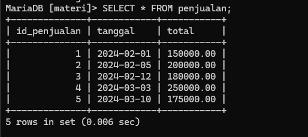
### *Contoh Stored Procedure: Total Penjualan per Bulan*  
Stored procedure ini menghitung total penjualan berdasarkan bulan dan tahun tertentu.  
#### Contoh Query
```mysql
DELIMITER //
CREATE PROCEDURE TotalPenjualanPerBulan(IN tahun INT, IN bulan INT, OUT total_penjualan DECIMAL(10,2))
BEGIN
    SELECT SUM(total) INTO total_penjualan
    FROM penjualan
    WHERE YEAR(tanggal) = tahun AND MONTH(tanggal) = bulan;
END //
DELIMITER ;
```
#### Penjelasan 
- `IN tahun INT`: Input parameter untuk tahun (format angka).
- `IN bulan INT`: Input parameter untuk bulan (format angka).
- `OUT total_penjualan DECIMAL(10,2)`: Output parameter yang menyimpan hasil total penjualan dalam bentuk desimal (2 angka di belakang koma).
- `SELECT SUM(total) INTO total_penjualan`: Mengambil jumlah total nilai dari kolom `total` di tabel `penjualan`.
- `FROM penjualan`: Mengambil data dari tabel `penjualan`.
- `WHERE YEAR(tanggal) = tahun AND MONTH(tanggal) = bulan`: Menggunakan kondisi untuk memfilter data hanya untuk tahun dan bulan yang sesuai dengan parameter yang diberikan.

---
#### Cara Memanggil Stored Procedure
Untuk menjalankan stored procedure, gunakan:  
##### Query
```mysql
CALL TotalPenjualanPerBulan(2024, 3, @hasil);
SELECT @hasil AS total_penjualan;
```
##### Penjelasan
- `CALL` → Digunakan untuk memanggil sebuah prosedur tersimpan (stored procedure) yang sudah dibuat di database.
- `TotalPenjualanPerBulan(2024, 3, @hasil)` → Memanggil prosedur tersimpan `TotalPenjualanPerBulan` dengan tiga parameter:
    - `2024` → Tahun yang menjadi parameter pertama.
    - `3` → Bulan yang menjadi parameter kedua.
    - `@hasil` → Variabel output yang digunakan untuk menyimpan hasil dari prosedur tersimpan. Variabel ini akan diisi oleh prosedur dengan nilai total penjualan pada bulan Maret 2024.
- `SELECT @hasil AS total_penjualan` → Menampilkan hasil yang disimpan dalam variabel `@hasil` dan memberi alias pada hasil tersebut dengan nama `total_penjualan`.

##### Hasil  
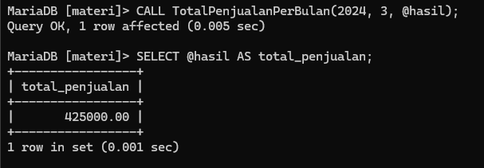
Ini menunjukkan total penjualan di bulan Februari 2024 adalah Rp530.000.  

---
## Langkah-Langkah Pembuatannya di phpMyadmin

1. Pertama-tama kita buka phpMyadmin di browser, setelah itu pilih database yang akan kita gunakan.
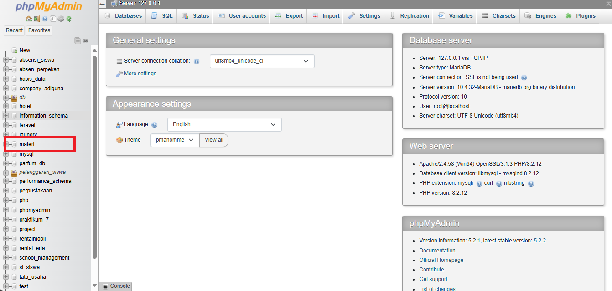

2. Setelah masuk kedalam database yang ingin kita gunakan,selanjutnya kita pilih menu SQL pada navbar.
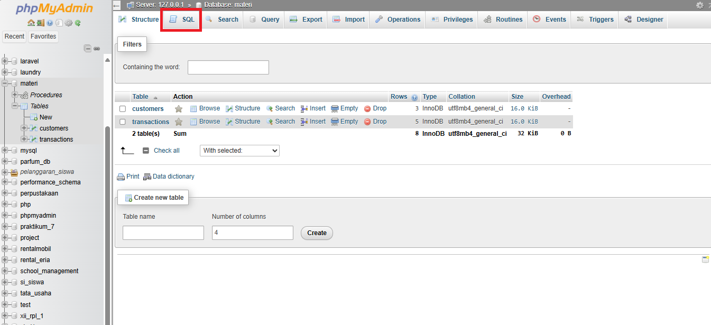

3. Selanjutnya kita akan membuat sebuah tabel dengan nama penjualan.
```mysql
CREATE TABLE penjualan {
	id_penjualan INT AUTO_INCREMENT PRIMARY KEY,
	tanggal DATE,
	total DECIMAL(10,2)
};
```
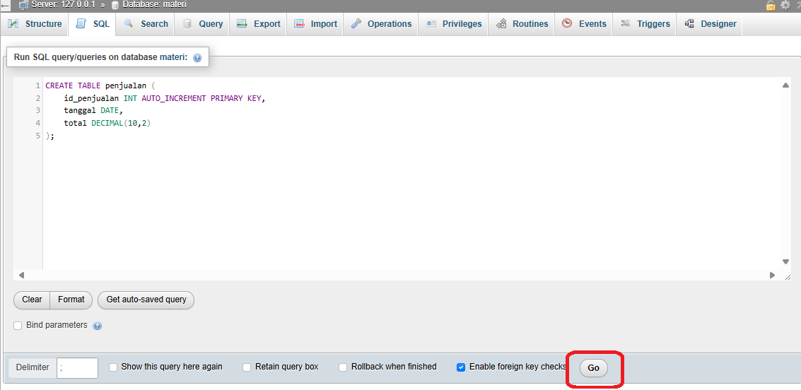

4. Setelah pembuatan tabel, selanjutnya kita akan mengisi tabelnya dengan data sebagai beriku.
```mysql
INSERT INTO penjualan (tanggal,total) VALUES
('2024-02-01',150000),
('2024-02-01',200000),
('2024-02-01',180000),
('2024-02-01',250000),
('2024-02-01',175000)
```

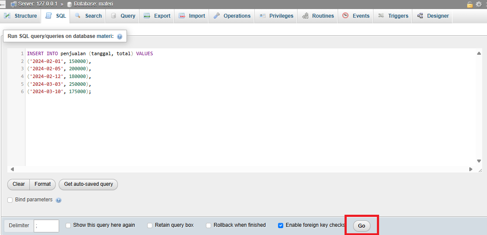

5.  Seteleh pengisian data pada tabel, kita lanjut masuk kedalam tabel penjualan.
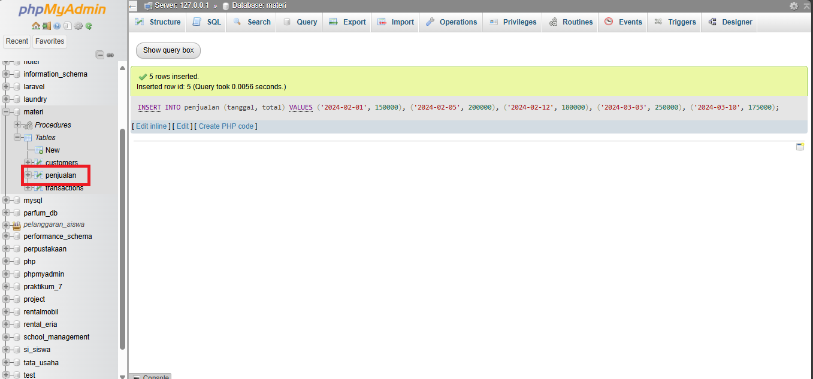

6. Lalu kita pilih menu SQL pada bagian navbar, setelah itu masukkan kode Stored Procedure dan klik GO.
```mysql
DELIMITER //
CREATE PROCEDURE TotalPenjualanPerBulan(IN tahun INT, IN bulan INT, OUT total_penjualan DECIMAL(10,2))
BEGIN
    SELECT SUM(total) INTO total_penjualan
    FROM penjualan
    WHERE YEAR(tanggal) = tahun AND MONTH(tanggal) = bulan;
END //
DELIMITER ;
```

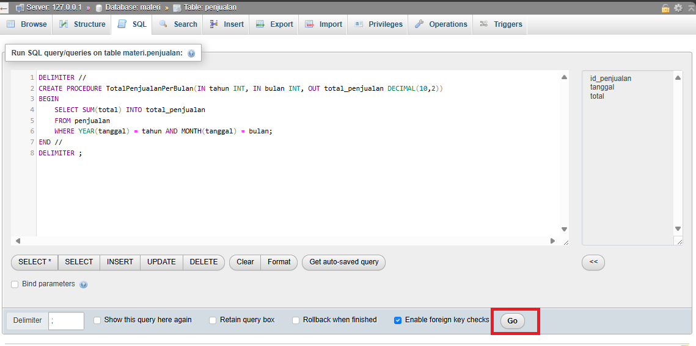

7. Setelah itu kita akan mengecek dengan masuk kedalam procedures,
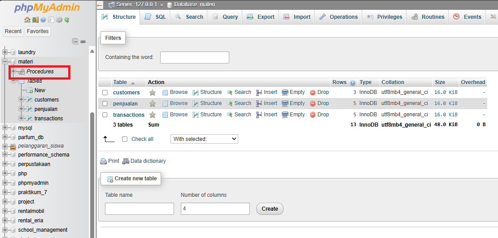


8. Pada gambar dibawah terdapat 1 procedure yang telah kita buat sebelumnya.
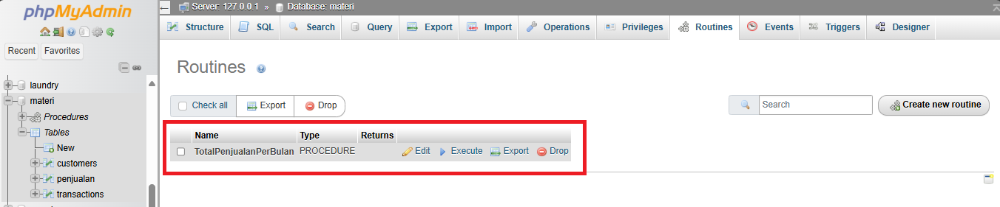

9. Untuk menjalankan Stored Procedure kiat gunakan query yang ada pada gambar, pada kasus ini kita ingin melihat total penjualan pada bulan 3, setelah itu kita klik GO
```mysql
CALL TotalPenjualanPerBulan(2024, 3, @hasil);
SELECT @hasil AS total_penjualan;
```

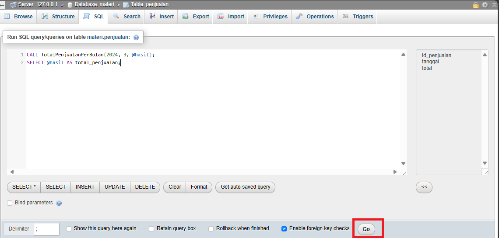

10. Berikut Hasilnya
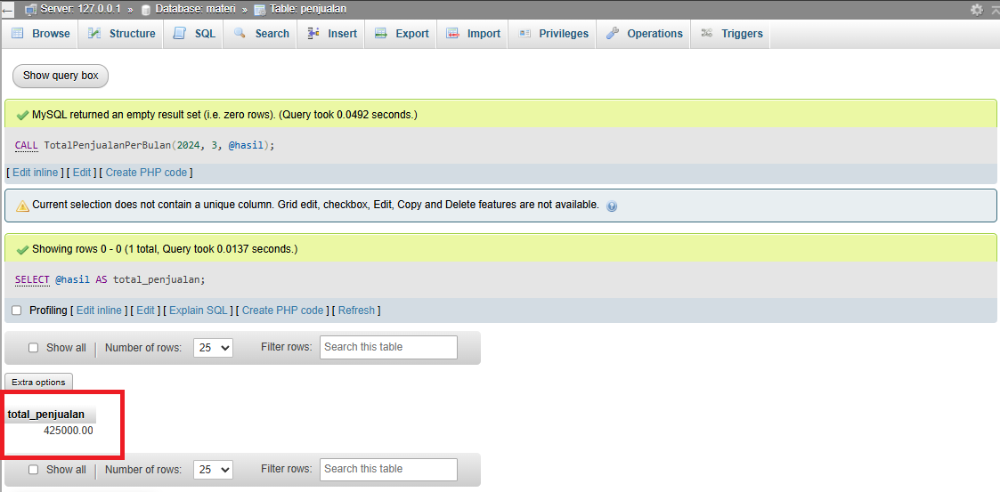

---
## Studi Kasus
*Studi Kasus: Laporan Penjualan Bulanan untuk Manajemen*  
Seorang pemilik toko ingin melihat total penjualan tiap bulan agar dapat menganalisis performa bisnisnya. Dengan stored procedure ini, manajemen hanya perlu memanggilnya dengan bulan dan tahun tertentu, tanpa menulis ulang query SQL setiap saat.  

```mysql
DELIMITER $$

CREATE PROCEDURE LaporanPenjualanBulanan(
    IN tahun_param INT,
    IN bulan_param INT
)
BEGIN
    -- Mengambil total penjualan berdasarkan bulan dan tahun yang dipilih
    SELECT DATE_FORMAT(tanggal, '%Y-%m') AS bulan, 
           SUM(total) AS total_penjualan
    FROM penjualan
    WHERE YEAR(tanggal) = tahun_param AND MONTH(tanggal) = bulan_param
    GROUP BY bulan;
END $$

DELIMITER ;

```

Penjelasan Kode
- `DELIMITER $$`: Mengubah pembatas perintah agar MySQL tahu kapan prosedur berakhir.
- `CREATE PROCEDURE`: Membuat prosedur baru bernama **`LaporanPenjualanBulanan`**.
- `IN tahun_param INT`, `IN bulan_param INT`: Parameter input untuk menentukan tahun dan bulan yang ingin dilihat.
- `SELECT`: Mengambil data penjualan dengan:
    - **`DATE_FORMAT`**: Mengubah tanggal menjadi format `YYYY-MM`.
    - **`SUM(total)`**: Menghitung total penjualan untuk periode tersebut.
    - **`WHERE`**: Memfilter data berdasarkan tahun dan bulan yang dimasukkan.
    - **`GROUP BY bulan`**: Mengelompokkan hasil berdasarkan bulan.
- `DELIMITER ;`: Mengembalikan pembatas ke default (`;`).


Cara Menggunakan Stored Procedure  
Setelah prosedur dibuat, cukup panggil dengan `CALL`:
```mysql
CALL LaporanPenjualanBulanan(2024, 2,3);
```

Hasil
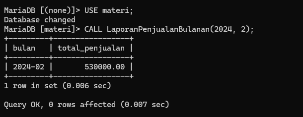

---
## Kesimpulan 
- Stored procedure membantu mengotomatisasi tugas SQL berulang dan meningkatkan efisiensi sistem database.  
- Dengan PHPMyAdmin, pembuatan dan eksekusi stored procedure menjadi lebih mudah.  
- Studi kasus seperti laporan penjualan bulanan menunjukkan manfaat nyata dalam dunia bisnis.  

