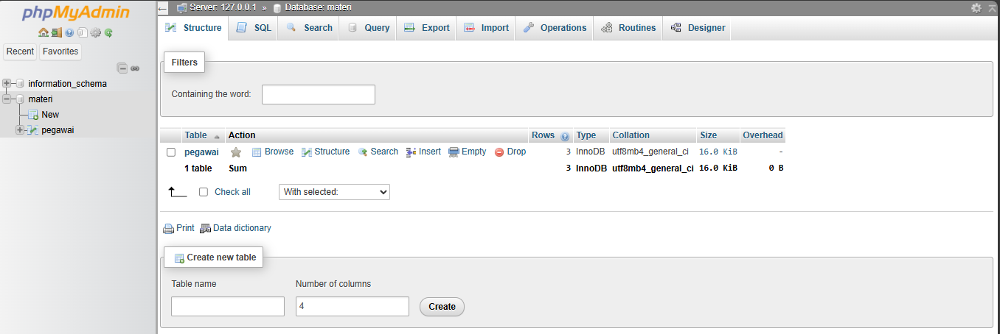

## Definisi
`GRANT` dan `REVOKE` adalah perintah dalam Database Control Language (DCL) yang digunakan untuk mengatur hak akses pengguna terhadap database.  
- `GRANT` digunakan untuk memberikan hak akses kepada pengguna tertentu terhadap objek database seperti tabel, view, atau prosedur.  
- `REVOKE` digunakan untuk mencabut hak akses yang sebelumnya telah diberikan kepada pengguna.  

---
## Fungsi/Luaran 
### GRANT  
- Memberikan hak akses kepada pengguna atau role tertentu.  
- Memungkinkan pengelolaan database yang lebih aman dengan membatasi hak akses hanya kepada pengguna yang berwenang.  
### REVOKE 
- Menghapus atau mencabut hak akses yang sebelumnya telah diberikan.  
- Mengontrol keamanan database dengan memastikan hanya pengguna yang berhak dapat melakukan perubahan.  

---
## Format Query
### GRANT  

```mysql
GRANT {hak_akses} ON {nama_tabel} TO {nama_pengguna};
```
- `{hak_akses}` bisa berupa SELECT, INSERT, UPDATE, DELETE, dll.  
- `{nama_tabel}` adalah nama tabel yang diberikan hak akses.  
- `{nama_pengguna}` adalah nama pengguna yang menerima hak akses.  
### REVOKE

```mysql
REVOKE {hak_akses} ON {nama_tabel} FROM {nama_pengguna};
```
- `{hak_akses}` adalah hak akses yang ingin dicabut.  
- `{nama_tabel}` adalah tabel yang terkait dengan hak akses tersebut.  
- `{nama_pengguna}` adalah pengguna yang hak aksesnya akan dicabut.  

---
### Pembuatan User Baru

```mysql
CREATE USER '{nama_pengguna}'@'{host}' IDENTIFIED BY '{password}';
```
- `{nama_pengguna}` → Nama pengguna yang ingin dibuat (contoh: `user1`).
- `{host}` → Host yang diizinkan mengakses (contoh: `localhost` atau `%` untuk semua host).
- `{password}` → Kata sandi untuk pengguna tersebut (contoh: `password123`).

#### Contoh
```mysql
CREATE USER 'user1'@'localhost' IDENTIFIED BY 'password123';
```

Pengguna `user1` akan dibuat dengan akses hanya dari `localhost`, menggunakan password `password123`.

**Kalau mau cek pengguna yang sudah dibuat**
```mysql
SELECT user, host FROM mysql.user;
```

---
### Hapus User

```mysql
DROP USER '{nama_pengguna}'@'{host}';
```
**Penjelasan:**
- `{nama_pengguna}` → Nama user yang mau dihapus.
- `{host}` → Host pengguna (biasanya `localhost`).
#### Contoh
Menghapus user `user1` di localhost:
```mysql
DROP USER 'user1'@'localhost';
```

---
## Contoh Query Beserta Hasil dan Penjelasan  
### *Tabel Utama*  
Sebelum menerapkan perintah *GRANT* dan *REVOKE*, kita buat tabel pegawai terlebih dahulu:  
```mysql
CREATE TABLE pegawai (
    id INT AUTO_INCREMENT PRIMARY KEY,
    nama VARCHAR(50),
    jabatan VARCHAR(50),
    gaji INT
);
```

```mysql
INSERT INTO pegawai (nama, jabatan, gaji) VALUES
('Andi', 'Manager', 10000000),
('Budi', 'Staff', 5000000),
('Siti', 'Admin', 4000000);
```

Hasilnya jika kita menjalankan perintah:  


---
### Pemberian Hak Akses (GRANT)
*Misalkan kita memiliki pengguna user1 dan kita ingin memberinya hak akses hanya bisa melihat data pegawai.* 
#### Penjelasan
`GRANT` digunakan untuk **memberikan izin (privilege)** kepada pengguna untuk melakukan tindakan tertentu pada database atau tabel, seperti membaca data, memasukkan data, atau mengubah data.
#### Format Query
```mysql
GRANT [jenis_hak_akses] ON [nama_tabel] TO '[nama_pengguna]'@'[host]';
```
#### Contoh Query
```mysql
GRANT SELECT ON pegawai TO 'user1'@'localhost';
```
#### Analisis
- **`GRANT`** → Memberikan izin/hak akses ke pengguna tertentu.
- **`SELECT`** → Hak akses untuk **membaca data** (melihat isi tabel) tanpa bisa mengubahnya.
- **`ON pegawai`** → Menentukan tabel yang akan diakses, dalam hal ini tabel bernama `pegawai`.
- **`TO 'user1'@'localhost'`** → Menentukan pengguna (`user1`) yang hanya bisa mengakses database dari **komputer lokal** (localhost).
#### Hasil 


disini saya mencoba `INSERT` tetapi gagal itu dikarenakan `User1` tidak memiliki Hak Akses.


Artinya, `user1` hanya dapat membaca data di tabel `pegawai`, tetapi tidak dapat menambah, mengubah, atau menghapus data.  

---
### Pencabutan Hak Akses (REVOKE) 
Jika kita ingin mencabut hak akses `SELECT` dari `user1`, maka perintahnya:  
#### Penjelasan
`REVOKE` digunakan untuk mencabut atau menghapus hak akses dari pengguna tertentu.
#### Format Query
```mysql
REVOKE [jenis_hak_akses] ON [nama_tabel] FROM '[nama_pengguna]'@'[host]';
```
#### Contoh Query
```mysql
REVOKE SELECT ON pegawai FROM 'user1'@'localhost';
```
#### Analisis
- `REVOKE` Menghapus atau mencabut izin/hak akses dari pengguna tertentu.
- `SELECT` Jenis hak akses yang dicabut (dalam hal ini, hak untuk melihat data).
- `ON pegawai` Menentukan tabel yang terkait, yaitu tabel `pegawai`.
- `FROM 'user1'@'localhost'` Menentukan pengguna yang akan dicabut haknya, dalam hal ini `user1` yang terhubung dari localhost (komputer server itu sendiri).

#### Hasil


User1 sudah tidak dapat akses untuk melihat tabel `Pegawai`.


---
## Langkah-Langkah Pembuatan GRANT & REVOKE di phpMyAdmin

Berikut adalah langkah-langkah spesifik untuk memberikan dan mencabut hak akses pengguna di *phpMyAdmin*.  

---

1. Buka browser dan akses localhost/phpmyadmin setelah itu masuk ke User accounts


2. Klik *"Add user account"*.  


3. Masukkan detail pengguna baru:  
   - *User name:* user1  
   - *Host name:* Pilih *"Local"* (localhost).  
   - *Password:* Masukkan password (misalnya password123).  
4. Pada bagian *Global Privileges*, biarkan kosong jika hanya ingin memberikan akses ke tabel tertentu.  
5. Klik *"Go"* untuk menyimpan.  


6. Setelah kita buat akun kita kembali ke User accounts untuk melihat apakah user yang dibuat sudah ada


7. Selanjutnya kita buka SQL pada pada bagian navbar untuk memberikan Hak akses kepada manager, disini manager kita berikan akses hanya dapat melihat (`SELECT`). berikut querynya.


8. Berikut Akses yang di berikan kepada manager, hanya dapat `SELECT` materi` tabel `pegawai`

 
9. Selanjutnya kita login ke phpMyadmin menggunakan User yang sudah dibuat yaitu manager.


10. Pada halaman Manager hanya terdapat 1 database dan 1 tabel, itu karna kita  sudah atur hak akses yang diberikan kepada manager.


11. Hak akses yang diberikan kepada manager hanya `SELECT`, makanya terdapat pesan error ketika mencoba `INSERT` data.


12. Selanjutnya kita coba login dengan user root.


13. Pada halaman User root kita masuk kebagian `SQL` , untuk menghapus Hak Akses manager yang sudah diberikan sebelumnya.


14. Untuk menghapus Hak Akses manager kita hanya perlu kosongkan hak akses apa yang ingin dicabut


15. Selanjutnya kita kembali Masuk ke Manager, pada halaman Manager sudah tidak terdapat database, karena sebelumnya kita sudah mencabut hak aksesnya.


Dengan mengikuti langkah-langkah ini, kita dapat mengatur hak akses database dengan aman menggunakan phpMyAdmin.

---


## Studi Kasus
### *Kasus: Pengaturan Hak Akses Karyawan dalam Perusahaan*  
Sebuah perusahaan ingin mengelola akses ke database pegawai:  
- *HR Manager* bisa melihat dan mengubah data pegawai.  
- *Staff* hanya bisa melihat data pegawai.  
#### *Solusi Menggunakan GRANT dan REVOKE*  
 **1. Membuat Pengguna Baru**

```mysql
CREATE USER 'hr_manager'@'localhost' IDENTIFIED BY 'password123';
CREATE USER 'staff'@'localhost' IDENTIFIED BY 'password456';
```

- **`CREATE USER`**: Perintah ini digunakan untuk membuat akun pengguna baru di MySQL.
- `'hr_manager'@'localhost'`: Membuat pengguna dengan nama `hr_manager`, yang hanya bisa login dari `localhost`.
- `'staff'@'localhost'`: Membuat pengguna dengan nama `staff`, juga hanya bisa login dari `localhost`.
- **`IDENTIFIED BY`**: Mengatur password untuk pengguna.

>  Ini artinya perusahaan punya dua pengguna: `hr_manager` dan `staff`, masing-masing dengan password mereka sendiri.

---

**2. Memberikan Hak Akses ke HR Manager**

```mysql
GRANT SELECT, UPDATE ON pegawai TO 'hr_manager'@'localhost';
```

- **`GRANT`**: Memberikan hak akses ke pengguna.
- **`SELECT`**: Mengizinkan pengguna untuk membaca data dalam tabel.
- **`UPDATE`**: Mengizinkan pengguna untuk mengubah data dalam tabel.
- **`ON pegawai`**: Menentukan tabel yang diberi hak akses, dalam hal ini tabel `pegawai`.
- **`TO 'hr_manager'@'localhost'`**: Menentukan pengguna yang akan menerima hak akses tersebut.

>  Dengan ini, `hr_manager` bisa melihat dan mengubah data pegawai.

---

**3. Memberikan Hak Akses ke Staff**

```mysql
GRANT SELECT ON pegawai TO 'staff'@'localhost';
```

- **`GRANT SELECT`**: Memberikan hak akses hanya untuk membaca data dalam tabel.
- **`ON pegawai`**: Mengatur bahwa hak akses ini hanya berlaku untuk tabel `pegawai`.
- **`TO 'staff'@'localhost'`**: Memberikan hak akses ini ke pengguna `staff`.

>  Artinya, `staff` hanya bisa melihat data pegawai, tanpa bisa mengubahnya.

---

**4. Menghapus Hak Akses Staff**

```mysql
REVOKE SELECT ON pegawai FROM 'staff'@'localhost';
```

- **`REVOKE`**: Menghapus hak akses yang telah diberikan sebelumnya.
- **`SELECT`**: Menentukan hak akses yang ingin dicabut.
- **`ON pegawai`**: Menentukan tabel yang hak aksesnya dicabut.
- **`FROM 'staff'@'localhost'`**: Menentukan pengguna yang hak aksesnya akan dicabut.

>  Jika ada masalah keamanan atau perubahan kebijakan, perusahaan bisa langsung mencabut akses `staff`.

