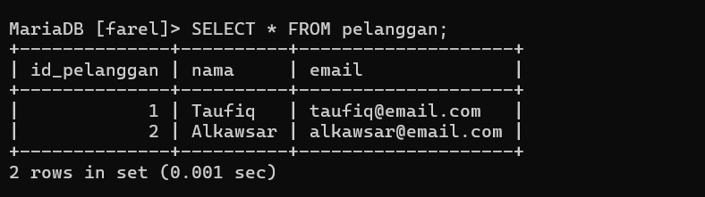
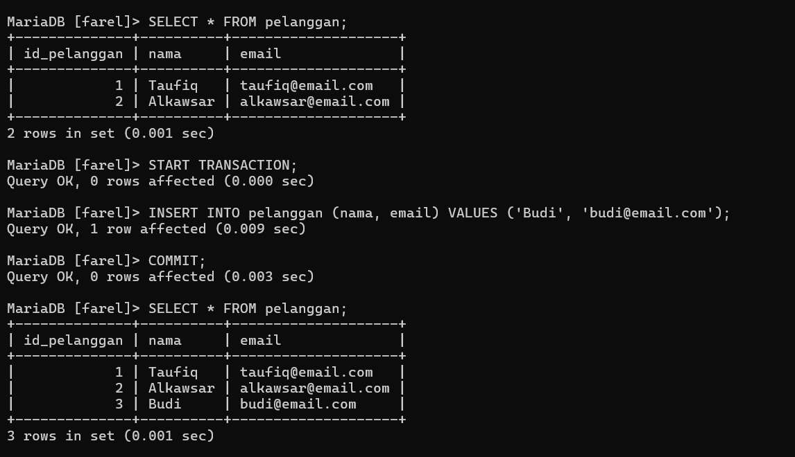
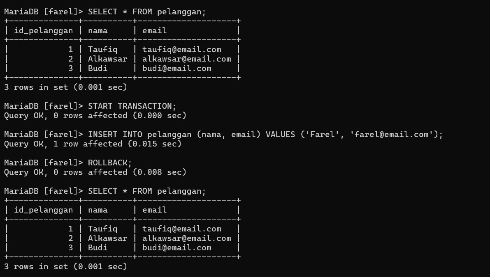
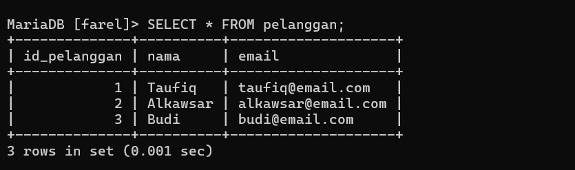
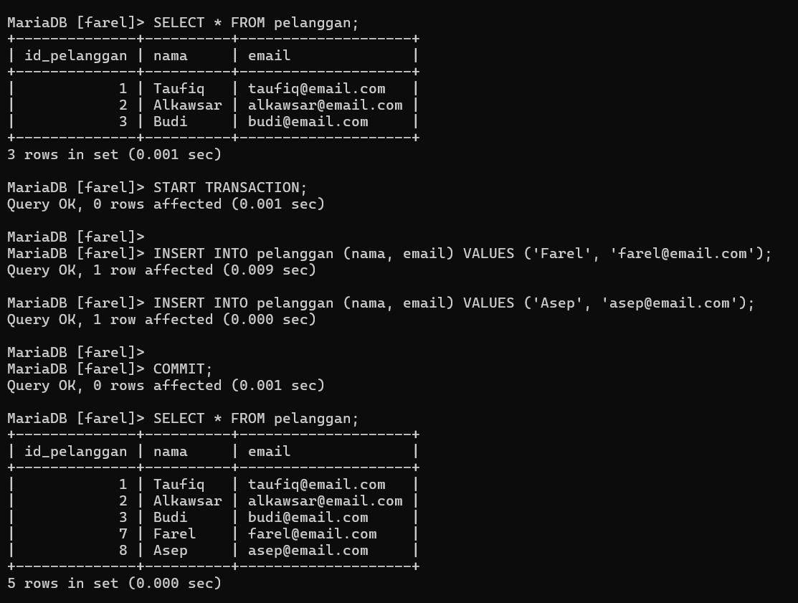
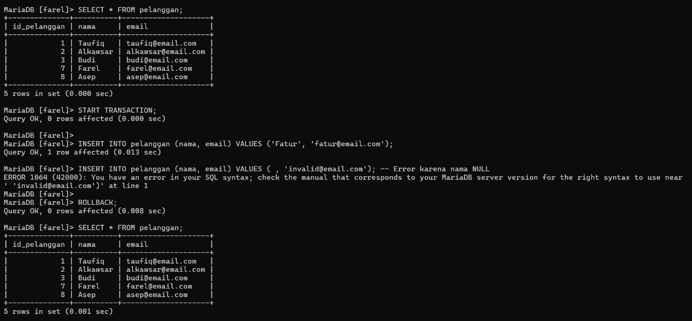

# TCL : `COMMIT` & `ROLLBACK`
Transaction Control Language (TCL): COMMIT & ROLLBACK

## Definisi
TCL (Transaction Control Language) adalah bagian dari SQL yang digunakan untuk mengelola transaksi dalam database. Dua perintah penting dalam TCL adalah:

`COMMIT`: Digunakan untuk menyimpan semua perubahan yang telah dilakukan dalam transaksi ke dalam database secara permanen.

`ROLLBACK`: Digunakan untuk membatalkan semua perubahan yang dilakukan dalam transaksi sebelum dilakukan `COMMIT`.

## Fungsi/Luaran
TCL digunakan untuk:

- Memastikan data tetap konsisten saat terjadi kesalahan dalam transaksi.
- Mengontrol kapan perubahan data disimpan secara permanen atau dibatalkan.
- Mengelola transaksi dalam sistem yang memerlukan keandalan tinggi, seperti perbankan dan e-commerce

---

## Tabel Utama : pelanggan 

>

---

### Menambahkan Data dengan `COMMIT`

#### PENJELASAN 
Query ini menambahkan pelanggan baru ke dalam tabel dan menyimpannya secara permanen dengan `COMMIT`.

#### QUERY

```SQL
START TRANSACTION;
INSERT INTO pelanggan (nama, email) VALUES ('Budi', 'budi@email.com');
COMMIT;
```

#### ANALISIS
- `START TRANSACTION`  
    Perintah ini digunakan untuk memulai sebuah transaksi database.  
    Transaksi memungkinkan beberapa perintah SQL dijalankan sebagai satu kesatuan, sehingga perubahan hanya akan disimpan jika seluruh perintah berhasil dijalankan.
    
- `INSERT INTO` pelanggan (nama, email) `VALUES` ('Budi', 'budi@email.com')  
    Perintah ini digunakan untuk menambahkan data baru ke dalam tabel pelanggan.  
    Dalam hal ini, data yang dimasukkan adalah nama "Budi" dan email "budi@email.com".
    
- `COMMIT`  
    Perintah ini digunakan untuk **menyimpan semua perubahan** yang dilakukan selama transaksi ke dalam database secara permanen.  
    Setelah `COMMIT`, data yang telah ditambahkan tidak bisa dibatalkan (kecuali dengan perintah `DELETE` atau `UPDATE` secara manual).

#### HASIL

>

---

### Membatalkan Transaksi dengan `ROLLBACK`

#### PENJELASAN 
Query ini menambahkan pelanggan baru, tetapi karena transaksi dibatalkan dengan `ROLLBACK`, data tidak akan tersimpan.

#### QUERY

```SQL

START TRANSACTION;
INSERT INTO pelanggan (nama, email) VALUES ('Farel', 'farel@email.com');
ROLLBACK;

```

#### ANALISIS
- `START TRANSACTION`  
    Perintah ini digunakan untuk memulai sebuah transaksi database.  
    Semua perintah SQL yang dijalankan setelahnya akan menjadi bagian dari transaksi tersebut dan tidak langsung disimpan secara permanen ke database sampai perintah `COMMIT` dijalankan.
- `INSERT INTO` pelanggan (nama, email) `VALUES` ('Farel', 'farel@email.com')  
    Perintah ini digunakan untuk menambahkan data baru ke dalam tabel pelanggan.  
    Data yang dimasukkan adalah nama Farel dan email farel@email.com.  
    Namun, karena masih dalam transaksi, data ini belum benar-benar disimpan ke dalam database.
- `ROLLBACK`  
    Perintah ini digunakan untuk membatalkan semua perubahan yang telah dilakukan dalam transaksi yang sedang berlangsung.  
    Dalam kasus ini, perintah `INSERT` dibatalkan, sehingga data Farel tidak akan ditambahkan ke tabel pelanggan.

#### HASIL

>

---

## STUDI KASUS

### KASUS
Seorang admin ingin menambahkan dua pelanggan baru ke database. Jika terjadi kesalahan saat memasukkan data, semua perubahan harus dibatalkan agar database tetap bersih.


#### Tabel Utama: pelanggan

>


##### Menambahkan Data dengan `COMMIT` (Berhasil, Data Tersimpan)

###### PENJELASAN 

Karena tidak ada kesalahan, perintah `COMMIT` dijalankan, sehingga data "Farel" dan "Asep" berhasil ditambahkan ke database.


###### QUERY

```SQL

START TRANSACTION;

INSERT INTO pelanggan (nama, email) VALUES ('Farel', 'farel@email.com');
INSERT INTO pelanggan (nama, email) VALUES ('Asep', 'asep@email.com');

COMMIT;

```

###### ANALISIS
- `START TRANSACTION`  
    Perintah ini digunakan untuk memulai sebuah transaksi database.  
    Semua perintah SQL yang dijalankan setelahnya akan menjadi bagian dari transaksi tersebut dan belum disimpan secara permanen ke dalam database sampai perintah `COMMIT` dijalankan.
    
- `INSERT INTO` pelanggan (nama, email) `VALUES` ('Farel', 'farel@email.com')  
    Perintah ini digunakan untuk menambahkan data baru ke dalam tabel pelanggan.  
    Data yang dimasukkan adalah nama: Farel dan email: farel@email.com.  
    Namun, karena transaksi belum selesai, data ini belum disimpan secara permanen.
    
- `INSERT INTO` pelanggan (nama, email) `VALUES` ('Asep', 'asep@email.com')  
    Perintah ini digunakan untuk menambahkan data lainnya ke dalam tabel pelanggan, yaitu nama: Asep dan email: asep@email.com.  
    Seperti sebelumnya, data ini juga belum disimpan secara permanen karena transaksi masih berlangsung.
    
- `COMMIT`  
    Perintah ini digunakan untuk menyimpan semua perubahan yang dilakukan selama transaksi ke dalam database secara permanen.  
    Setelah `COMMIT`, kedua baris data (Farel dan Asep) yang ditambahkan ke tabel pelanggan akan disimpan secara permanen dan tidak dapat dibatalkan.

###### HASIL

>


##### Menambahkan Data dengan `ROLLBACK` (Gagal, Data Dibatalkan)


###### PENJELASAN 
- Saat menambahkan "Fatur", tidak ada masalah.
- Namun, data berikutnya memiliki **NULL di kolom nama**, sehingga terjadi error.
- Karena terjadi kesalahan, `ROLLBACK` membatalkan semua perubahan, termasuk "Fatur".
- Tidak ada data baru yang tersimpan.


###### QUERY

```SQL
START TRANSACTION;

INSERT INTO pelanggan (nama, email) VALUES ('Fatur', 'fatur@email.com');
INSERT INTO pelanggan (nama, email) VALUES (, 'invalid@email.com'); -- Error karena nama NULL

ROLLBACK;
```

###### ANALISIS
- `START TRANSACTION`  
    Perintah ini digunakan untuk memulai sebuah transaksi database.  
    Semua perintah SQL yang dijalankan setelahnya akan menjadi bagian dari transaksi tersebut dan belum disimpan secara permanen ke dalam database sampai perintah `COMMIT` dijalankan atau `ROLLBACK` dilakukan.
- `INSERT INTO` pelanggan (nama, email) `VALUES` ('Fatur', 'fatur@email.com')  
    Perintah ini digunakan untuk menambahkan data baru ke dalam tabel pelanggan.  
    Data yang dimasukkan adalah nama: Fatur dan email: fatur@email.com.  
    Karena transaksi belum selesai, data ini belum disimpan secara permanen.
    
- `INSERT INTO` pelanggan (nama, email) `VALUES` (, 'invalid@email.com')  
    Perintah ini berisi kesalahan, yaitu nilai nama yang `NULL` (kosong) dan email yang valid invalid@email.com.  
    Jika kolom nama di tabel pelanggan tidak boleh berisi nilai `NULL` (misalnya kolom ini memiliki constraint `NOT NULL`), maka perintah ini akan gagal dan menghasilkan error.  
    Hal ini menyebabkan seluruh transaksi terhambat.
    
- `ROLLBACK`  
    Perintah ini digunakan untuk membatalkan semua perubahan yang dilakukan selama transaksi yang sedang berlangsung.  
    Karena terjadi error pada perintah `INSERT` kedua, perintah `ROLLBACK` akan membatalkan seluruh transaksi, termasuk data yang berhasil dimasukkan sebelumnya (yaitu data pelanggan Fatur).  
    Dengan demikian, tidak ada data yang disimpan ke dalam database.

###### HASIL

>

