# Modul Database Client - Server : FTP Hosting

## **1. Definisi**

FTP (File Transfer Protocol) adalah protokol jaringan yang digunakan untuk mentransfer file dari komputer lokal ke server atau sebaliknya melalui koneksi internet. Dalam konteks web hosting, FTP digunakan untuk mengunggah file website dari komputer kita ke server hosting, sehingga website bisa diakses secara online.

FTP memerlukan klien FTP, yaitu perangkat lunak yang digunakan untuk melakukan koneksi ke server hosting dan mengelola file yang ada di dalamnya. Salah satu klien FTP yang paling populer adalah **FileZilla**.

## **2. Fungsi**

Penggunaan FTP dalam dunia hosting memiliki beberapa fungsi penting, antara lain:
- Mengunggah file website (HTML, CSS, JavaScript, gambar, dll) ke server hosting.
- Mengatur struktur folder dan file di server hosting.
- Mempercepat proses upload dibandingkan menggunakan file manager bawaan hosting.
- Mengedit, mengganti, atau menghapus file website langsung dari komputer lokal.
- Memberikan kontrol penuh terhadap file dan direktori hosting secara langsung.

## **3. Langkah-langkah FTP ke Hosting**

### 1. Mengunduh dan Menginstal FileZilla
Langkah pertama adalah mengunduh dan memasang software FTP client bernama FileZilla.

- Pertama, buka situs resmi FileZilla di [https://filezilla-project.org/](https://filezilla-project.org/).
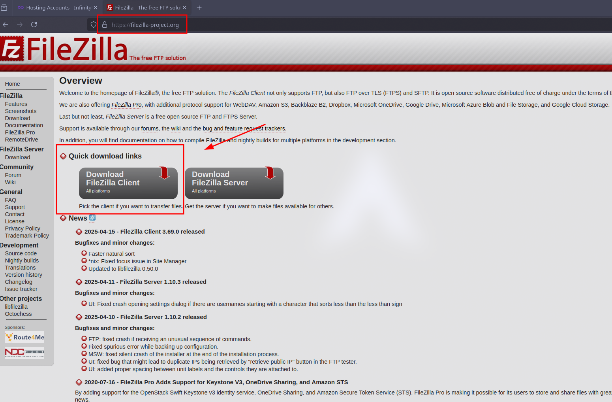
- Setelah itu, klik tombol **Download FileZilla Client**, lalu pilih sistem operasi yang digunakan (Windows, macOS, atau Linux).
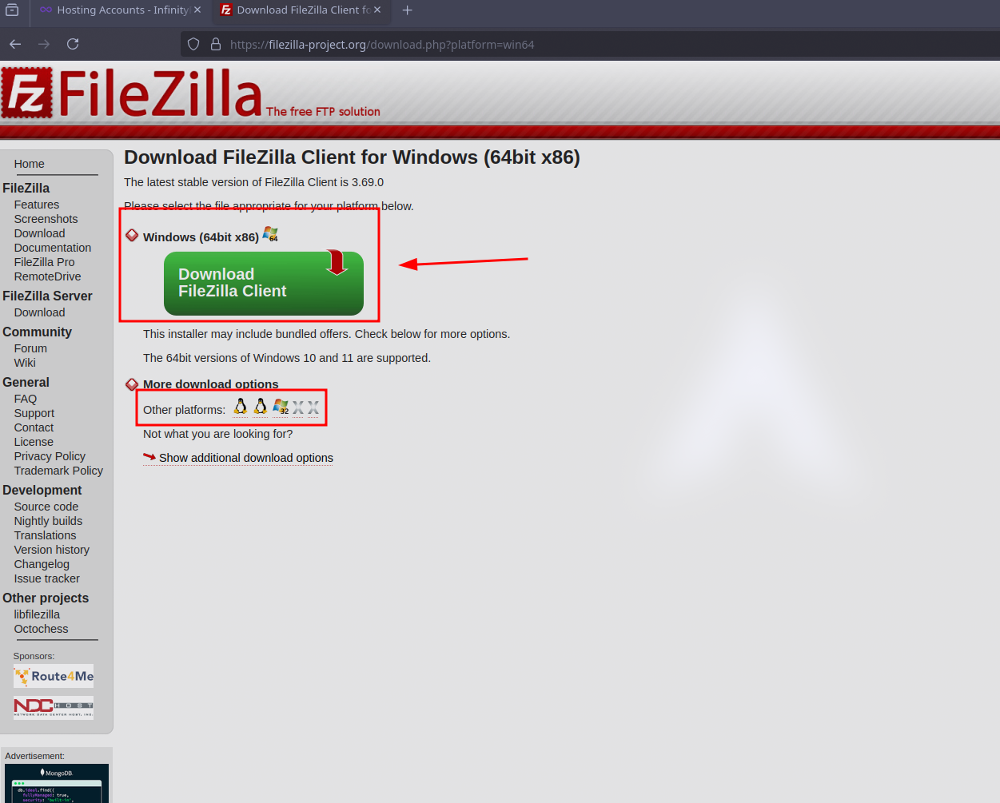
- Setelah proses download selesai, buka file instalasi dan ikuti proses instalasi sampai selesai dengan memilih opsi default.

### 2. Login ke Akun InfinityFree

Setelah FileZilla berhasil terpasang, langkah berikutnya adalah login ke akun hosting di InfinityFree.

- Buka situs [https://infinityfree.net/](https://infinityfree.net/).

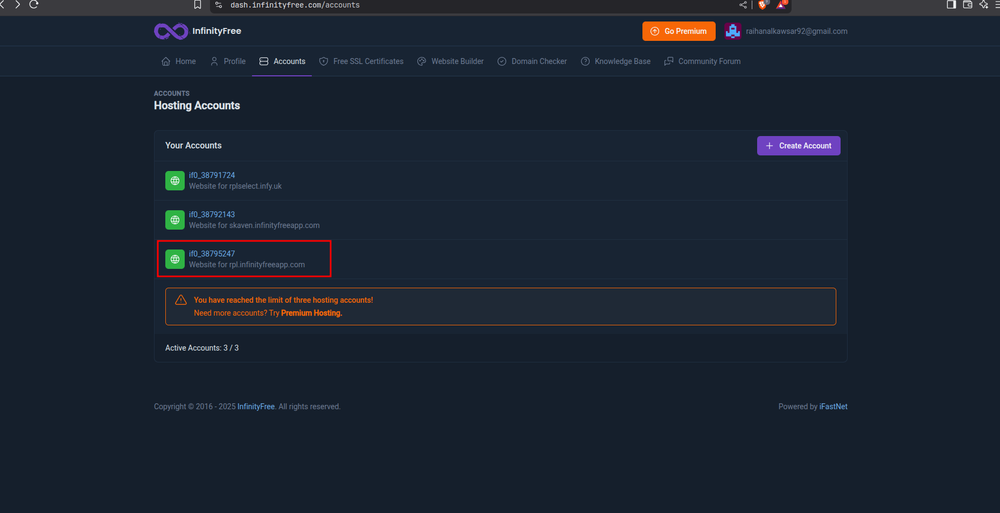

- Setelah berhasil login, klik pada nama domain atau nama akun hosting yang ingin digunakan.
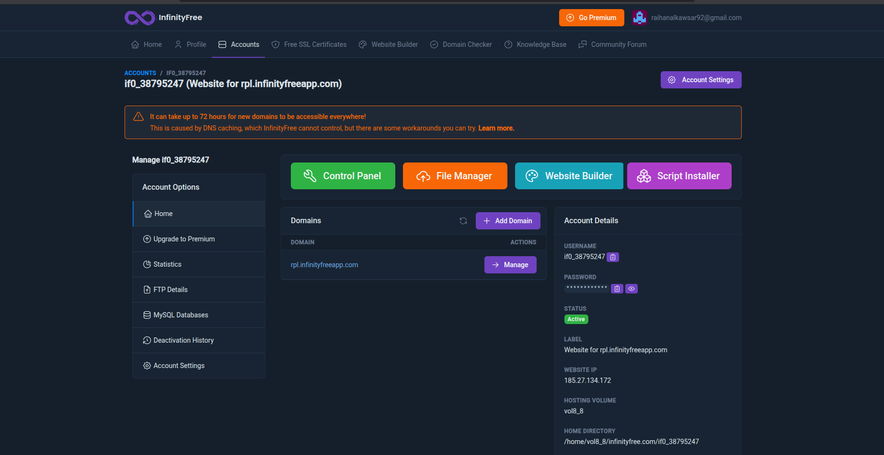

### 3. Menyalin Informasi FTP dari InfinityFree
Setelah masuk ke halaman detail akun hosting, scroll ke bawah hingga menemukan bagian **FTP Information**. Untuk menghubungkan FileZilla ke server hosting, dibutuhkan beberapa informasi penting.

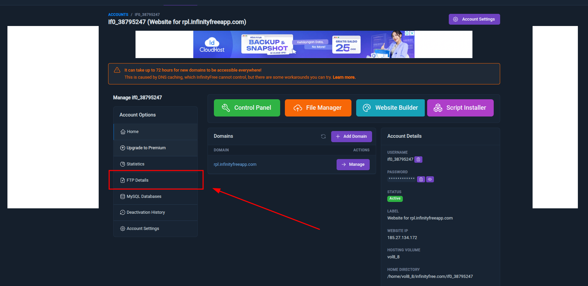

Masuk ke halaman detail akun hosting kamu, kemudian scroll ke bawah hingga menemukan bagian **FTP Information**.

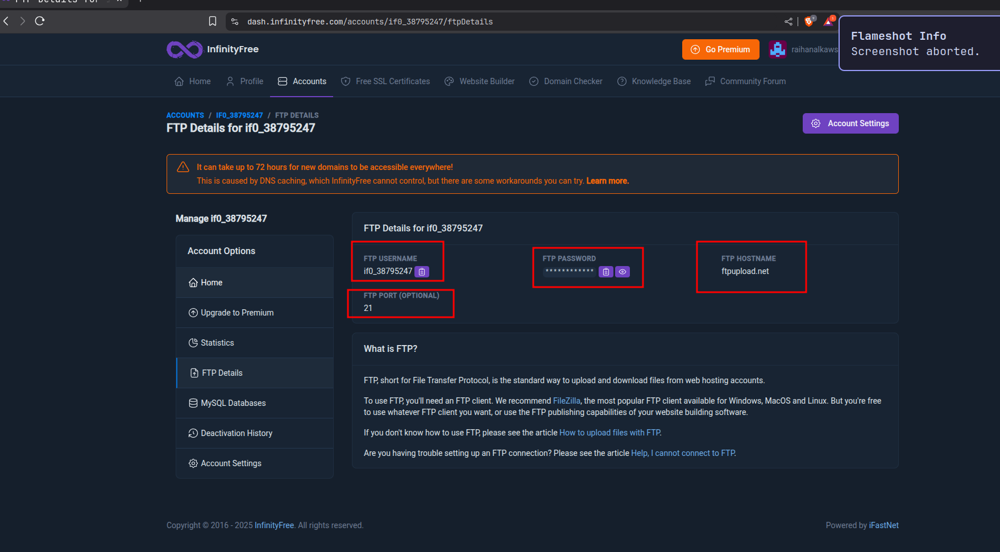

Salin informasi berikut:
- FTP Hostname    
- FTP Username
- FTP Password (gunakan password akun hosting Anda)
- Port (biasanya 21)       

### 4. Membuka dan Mengatur Koneksi di FileZilla

Setelah mendapatkan informasi FTP, buka aplikasi **FileZilla**.
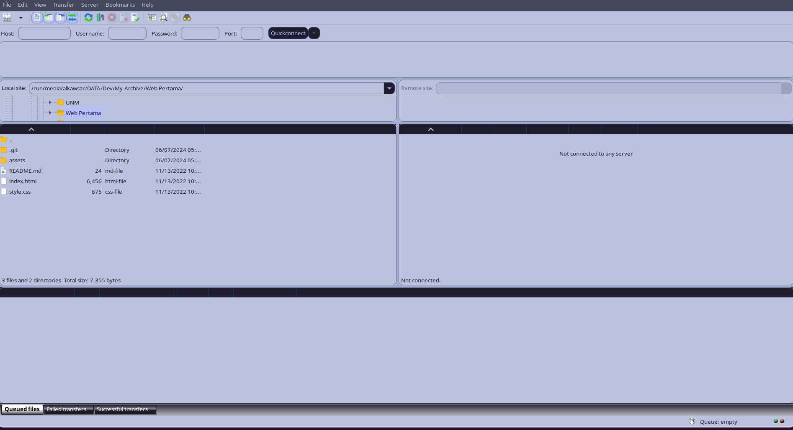

Klik menu **File** dan pilih **Site Manager**. Di jendela **Site Manager**, klik **New Site** dan beri nama, misalnya, "InfinityFree".
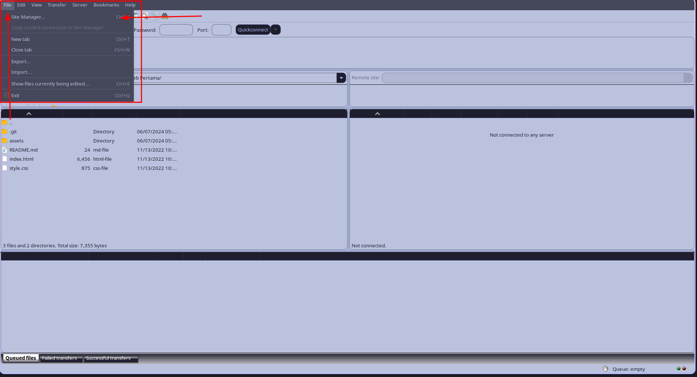

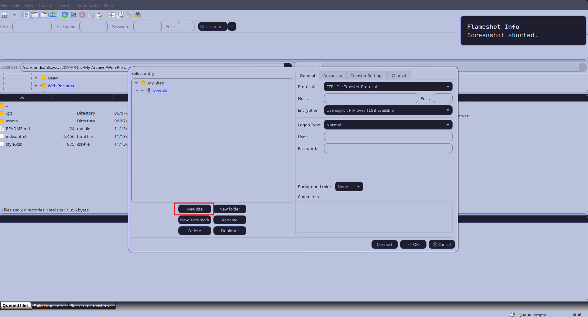

Pada bagian kanan, isikan informasi berikut:

- **Host**: Isi dengan **FTP Hostname** dari InfinityFree
- **Port**: Isi dengan angka **21**
- **Protocol**: Pilih **FTP – File Transfer Protocol**
- **Encryption**: Pilih **Use explicit FTP over TLS if available**
- **Logon Type**: Pilih **Normal**
- **User**: Isi dengan **FTP Username**
- **Password**: Isi dengan **FTP Password**

Setelah semua data terisi dengan benar, klik tombol **Connect**.

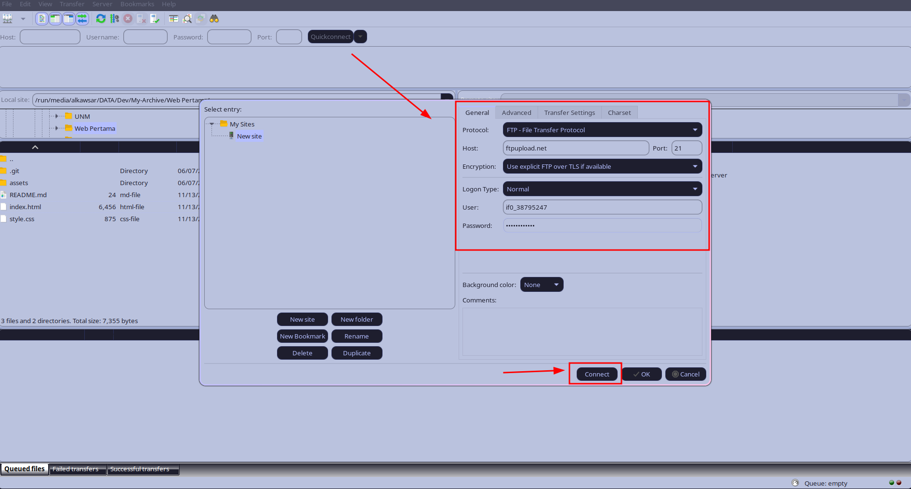

Setelah mengklik connect, tunggu hingga FileZilla berhasil terhubung ke server. Bila muncul peringatan keamanan terkait sertifikat, klik **OK** atau **Trust** untuk melanjutkan.

Jika berhasil, akan terlihat dua panel utama: sebelah kiri adalah file di komputer lokal, sebelah kanan adalah file di server hosting.

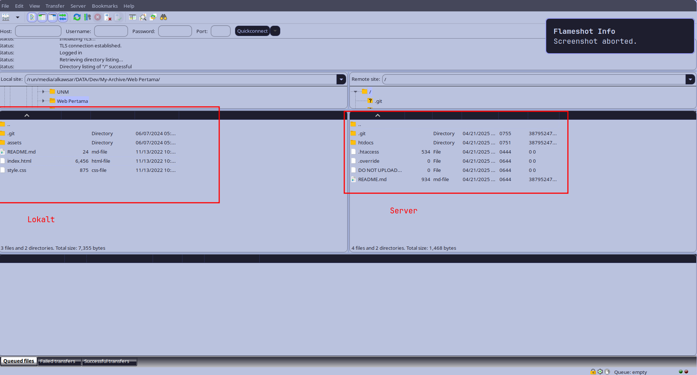

Sebelum mengunggah, pastikan file website sudah disiapkan di komputer Anda. Pada panel kiri (komputer lokal), navigasikan ke folder yang berisi file website Anda (misalnya `index.html`, `style.css`, dll)

Setelah file siap, kita perlu meletakkannya di folder yang benar agar bisa diakses sebagai website.

Pada panel kanan (server), buka folder **htdocs**.

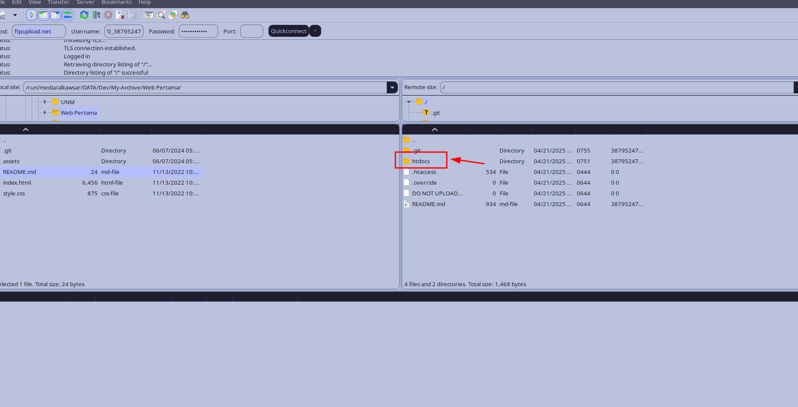

Kemudian, seret dan lepaskan (drag and drop) semua file website dari panel kiri ke folder htdocs di panel kanan.

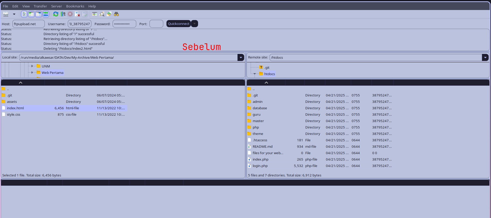

Tunggu proses upload selesai. Kecepatan upload tergantung dari jumlah dan ukuran file serta koneksi internet Anda.    

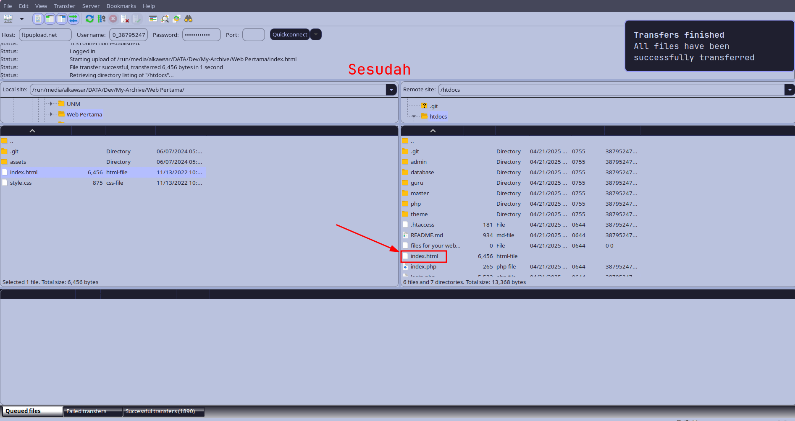

Setelah file berhasil diunggah, kita bisa langsung mengeceknya melalui browser. Buka browser dan ketik nama domain atau URL yang diberikan oleh InfinityFree, contohnya:  

```
http://rpl.infinityfreeapp.com/index.html
```
   
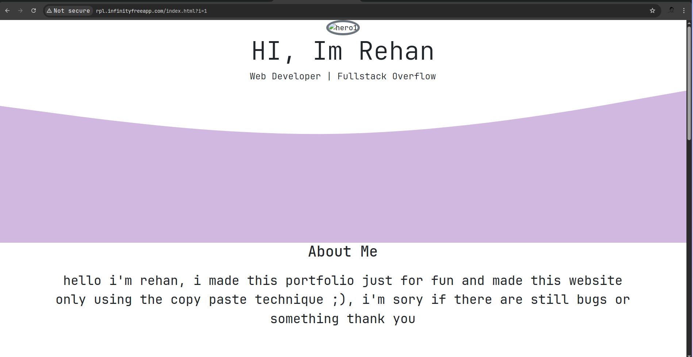